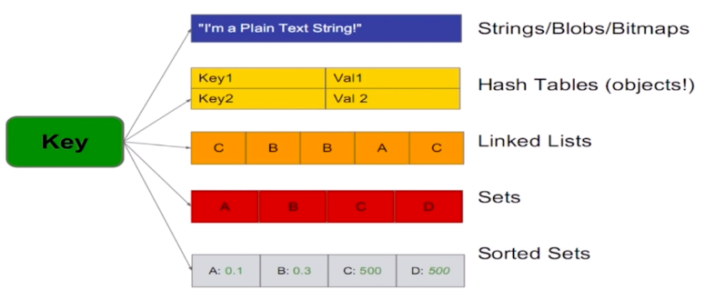
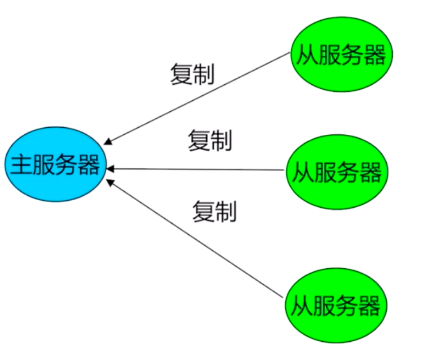
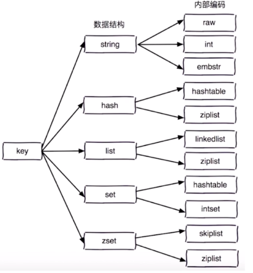
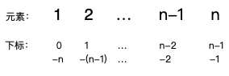
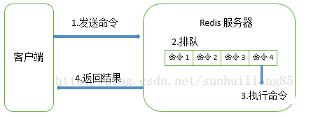

# redis
## 初识

### redis是什么

+ 开源

+ 基于键值对的存储服务系统

  > redis类似于数据库，以key-value形式存储数据

+ 支持多种数据结构

  > 字符串、hash table、linked list、sets、sorted sets等等

+ 性能高、功能丰富

### 特性

+ 速度快

  + 数据存在内存中
  + C语言实现
  + 单线程

+ 持久化

  > Redis 把所有数据保存在内存中，对数据的更新异步的保存在磁盘中

+ 多种数据结构

    

  基于以上数据结构，衍生支持了以下数据结构：

  + BitMaps：位图

    > 基于字符串

  + HyperLogLog：超小内存唯一值计数

    > 基于字符串

  + GEO：地理信息定位

    > 基于sorted sets

+ 支持多种编程语言

+ 功能丰富

  + 发布订阅

  + lua脚本

    > 实现自定义命令

  + 事务

  + pipeline

    > 提高客户端并发效率

+ 简单

+ 主从复制

    

+ 高可用、分布式

  + Redis-Sentinel(v2.8)支持高可用
  + Redis-Cluster(v3.0)支持分布式

### 典型使用场景

+ 缓存系统
+ 计数器
+ 消息队列系统
+ 排行榜
+ 社交网络
+ 实时系统

## 安装配置

### 安装

#### linux、Mac

+ 下载

  https://redis.io/download

+ 解压编译

  ```shell
  $ tar xzf redis-5.0.3.tar.gz
  $ cd redis-5.0.3
  $ make
  ```

  > 编译后并未将结果文件拷贝到其他位置，还在这个目录下，所以将这个目录拷贝到合适的位置，并配置环境变量，安装即可完成

+ 启动测试

  + 启动服务

    ```shell
    $ src/redis-server
    ```

  + 启动客户端

    ```shell
    $ redis-cli 
    127.0.0.1:6379> set hello world
    OK
    127.0.0.1:6379> get hello
    "world"
    ```

### 可执行文件说明

+ redis-server：redis服务器
+ redis-cli：redis命令行客户端
+ redis-benchmark：redis性能测试工具
+ redis-check-aof：aof文件修复工具
+ redis-check-rdb：rdb文件检查工具
+ redis-sentinel：sentinel服务器

### 启动方式

#### 服务端启动

+ 简单启动

  直接使用`redis-server`启动

+ 带参数启动

  redis默认端口为：6379

  使用6380启动：redis-server --port 6380

+ 配置文件启动

  + 编写配置文件`*.config`

  + 将配置文件作为第1个启动参数启动

    ```shell
    redis-server config/6380.conf
    ```

  > **redis启动参数及配置文件中的相对路径均是相对于执行启动命令的位置，所以使用相对路径时，需要到指定的目录下执行启动命令** 

#### 客户端启动

+ 以默认ip`localhost`默认端口`6379`启动

  ```shell
  $ redis-cli
  ```

+ 指定ip和端口启动

  ```shell
  $ redis-cli -h 127.0.0.1 -p 6380
  ```

### 配置

#### 查看与修改

+ 查看

  在客户端中

  使用`config get *`获取所有配置项

  使用`config get NAME`获取某个配置项，如：`CONFIG GET loglevel`

+ 修改配置

  在客户端中

  使用`config NAME VALUE`修改配置，如`config daemonize yes`

#### 配置项

+ port

  对外端口，默认6379

+ dir

  工作目录

+ logfile

  日志文件名

+ daemonize

  是否以守护进程方式启动，默认no，建议使用yes

  以守护进程启动时：

  + 执行启动命令后，服务将自动后台运行

  + 启动日志将打印到日志文件

### 可视化客户端

+ redis desktop manager

  很出名，但是不免费

+ medis

  [Medis 0.6.0 Mac 破解版 – 漂亮易用的Redis管理应用](https://www.waitsun.com/medis-0-6-0.html) 

+ TreeNMS

  基于web的redis可视化工具，搭建在服务器上在哪都能用

+ RedisPlus

  目前用这个

  java开发的工具，有监控功能和集群管理功能

  连接参见：https://gitee.com/MaxBill/RedisPlus

  Mac版在这里没有下载链接，在qq群`857111033`里有下载

## API理解与使用

### 数据结构与内部编码

 

### 字符串

#### 介绍

- 可以保存哪些值
  - 字符串
  - 数字
  - 二进制
  - json、xml等字符串
- 使用场景
  - 缓存
  - 计数器
  - 分布式锁
  - ...

#### 命令

- get

  语法：get KEY

  功能：获取字符串类型的key对应的value

- incr

  语法：incr KEY

  功能：key自增1，如果key不存在，自增后key=1

- decr

  语法：decr KEY

  功能：key自减1，如果key不存在，自减后key=1

- incrby

  语法：incrby KEY N

  功能：key自增n，如果key不存在，自增后key=n

- decrby 

  语法：decrby KEY N

  功能：key自减n，如果key不存在，自减后key=-n

- set

  语法：set KEY VALUE

  功能：不管key是否存在，都进行设置

- setnx

  语法：setnx KEY VALUE

  功能：key不存在时，才进行设置

- set xx

  语法：set KEY VALUE xx

  功能：key存在时，才进行设置

- setex

  语法：setex KEY SECONDS VALUE

  功能：相当于如下两条命令

  ```shell
  SET key value
  EXPIRE key seconds
  ```

  设置1个key同时设置过期时间

- mset

  语法：mset KEY VALUE [KEY VALUE ...]

  功能：创建多个键值对

  ```shell
  127.0.0.1:6380> mset key1 value1 key2 value2
  OK
  127.0.0.1:6380> keys *
  1) "key2"
  2) "key1"
  ```

- mget

  语法：mget KEY [KEY ...]

  功能：获取多个key

  ```shell
  127.0.0.1:6380> mget key1 key2
  1) "value1"
  2) "value2"
  ```

- getset 

  语法：getset KEY VALUE

  将新值设置到key，并返回旧值

- append

  语法：append KEY VALUE

  功能：将值追加到原有字符串之后

  ```shell
  127.0.0.1:6380> get key1
  "haha"
  127.0.0.1:6380> append key1 haah
  (integer) 8
  127.0.0.1:6380> get key1
  "hahahaah"
  ```

- strlen

  语法：strlen KEY

  功能：返回字符串长度

  注意：中文占用2个字节

- incrbyfloat

  语法：incrbyfloat KEY N

  功能：浮点数key自增n

  ```shell
  127.0.0.1:6380> incrbyfloat key5 3.5
  "3.5"
  127.0.0.1:6380> get key5
  "3.5"
  ```

- getrange

  语法：getrange KEY START END

  功能：获取指定下标的值

  第1个字母的下标为0

  ```shell
  127.0.0.1:6380> get key2
  "value2"
  127.0.0.1:6380> getrange key2 2 3
  "lu"
  ```

- setrange

  语法：setrange KEY INDEX VALUE

  功能：将key对应的值的某个下标的值替换为新值

  ```shell
  127.0.0.1:6380> get key2
  "value2"
  127.0.0.1:6380> setrange key2 2 L
  (integer) 6
  127.0.0.1:6380> get key2
  "vaLue2"
  ```


### hash

#### 介绍

- 键值结构

   

  hash类型的结构相对于字符串多了1个属性`field`，该结构类似于`javabean`对象，key相当于对象，field相当于对象中属性，value相当于属性值

#### 命令

- hset

  语法：hset KEY FIELD VALUE

  功能：无论key或field是否存在，都设置key中的field属性对应的value

- hsetnx

  语法：hsetnx KEY FIELD VALUE

  功能：只有key或field不存在时，才设置key中的field属性对应的value

- hget

  语法：hget KEY FIELD

  功能：获取key中的field属性对应的value

- hdel

  语法：hdel KEY FIELD

  功能：删除key中的field属性

- hgetall

  语法：hgetall KEY

  功能：获取key中所有属性和值

- hexists

  语法：hexists KEY FIELD

  功能：查看key或key中的属性是否存在

- hlen

  语法：hlen KEY

  功能：查看key中field属性的数量

- hmget

  语法：hmget KEY FIELD [FIELD ... ]

  功能：获取key中多个field属性的值

- hmset

  语法：hmset KEY FIELD VALUE [FIELD VALUE ...]

  功能：批量设置key中的属性

- hgetall

  语法：hgetall KEY

  功能：获取key对应的所有的key和value

- hvals

  语法：hvals KEY

  功能：获取key对应的所有value

- hkeys

  语法：hkeys KEY

  功能：获取key对应的所有的field

- hincrby

  语法：hincrby KEY FIELD N

  功能：key中的field属性自增n

- hincrbyfloat

  语法：hincrbyfloat KEY FIELD F

  功能：key中的field属性自增浮点数f

### list

#### 介绍

- `key:list`结构

- list集合中的元素分别有正负2个下标

  长度为n的list，第1个元素的下标为0，同时也是-n；最后1个元素下标为n-1，同时也是-1

   

#### 命令

- rpush

  语法：rpush KEY VALUE [VALUE ...]

  功能：从列表右侧依次添加多个元素

  例：

  ```shell
  127.0.0.1:6380> rpush list2 a b c
  (integer) 3
  127.0.0.1:6380> lrange list2 0 -1
  1) "a"
  2) "b"
  3) "c"
  ```

- lpush

  语法：lpush KEY VALUE [VALUE ...]

  功能：从列表左侧依次添加多个元素

  例：

  ```shell
  127.0.0.1:6380> lpush list1 a b c
  (integer) 3
  127.0.0.1:6380> lrange list1 0 -1
  1) "c"
  2) "b"
  3) "a"
  ```

- linsert

  语法：linsert KEY before/after VALUE NEWVALUE

  功能：	在名为key的list集合的指定值value前/后插入新值newValue；

  ​		如果存在多个相同的value，则以从左至右第1个为准；

  ​		如果key或value不存在，则插入失败

  例

  ```shell
  127.0.0.1:6380> lrange list1 0 -1
  1) "a"
  2) "b"
  3) "c"
  4) "c"
  127.0.0.1:6380> linsert list1 after c d
  (integer) 5
  127.0.0.1:6380> lrange list1 0 -1
  1) "a"
  2) "b"
  3) "c"
  4) "d"
  5) "c"
  ```

- lpop

  语法：lpop KEY

  功能：从左边弹出(删除并返回)1个元素

  例

  ```shell
  127.0.0.1:6380> lrange list1 0 -1
  1) "a"
  2) "b"
  3) "c"
  4) "d"
  5) "c"
  127.0.0.1:6380> lpop list1
  "a"
  127.0.0.1:6380> lrange list1 0 -1
  1) "b"
  2) "c"
  3) "d"
  4) "c"
  ```

- blpop

  语法：blpop KEY [KEY ...] timeout

  功能：	lpop的阻塞版本

  ​		当key1、key2等集合中有不是空集合的集合时，立即返回该集合中的元素

  ​		   当key1、key2等均是空集合时，等待timeout秒，超时返回`nil`

  ​		等待过程中，当key1、key2等集合中任一集合有新元素时，立即返回该集合中的元素

  ​		当timeout=0时，表示一直阻塞

  例：

  ```shell
  127.0.0.1:6380> blpop list2 list3 10
  (nil)
  (10.07s)
  127.0.0.1:6380> blpop list2 list3 20
  1) "list2"
  2) "a"
  (12.90s)
  ```

  说明：当有新元素返回时，返回的第1个元素为集合名称，第2个元素才是真正要返回的元素

- rpop

  语法：rpop KEY

  功能：从右边弹出(删除并返回)1个元素

  例

  ```shell
  127.0.0.1:6380> lrange list1 0 -1
  1) "b"
  2) "c"
  3) "d"
  4) "c"
  127.0.0.1:6380> rpop list1
  "c"
  127.0.0.1:6380> lrange list1 0 -1
  1) "b"
  2) "c"
  3) "d"
  ```

- brpop

  跟`blpop`一个道理

- lrem

  语法：lrem KEY COUNT VALUE

  功能：	在名为key的list集合中删除值为value的元素

  ​		count>0时，从左到右，最多删除count个

  ​		count<0时，从右至左，最多删除count个

  ​		count=0时，删除全部

  例：

  ```shell
  127.0.0.1:6380> lrange list1 0 -1
  1) "a"
  2) "b"
  3) "c"
  4) "a"
  5) "b"
  6) "c"
  127.0.0.1:6380> lrem list1 2 a
  (integer) 2
  127.0.0.1:6380> lrange list1 0 -1
  1) "b"
  2) "c"
  3) "b"
  4) "c"
  ```

- ltrim

  语法：ltrim KEY START END

  功能：截取指定范围内的元素

  例：

  ```shell
  127.0.0.1:6380> lrange list2 0 -1
  1) "a"
  2) "b"
  3) "c"
  4) "d"
  5) "e"
  127.0.0.1:6380> ltrim list2 1 3
  OK
  127.0.0.1:6380> lrange list2 0 -1
  1) "b"
  2) "c"
  3) "d"
  ```

- lrange

  语法：lrange KEY START END

  功能：	获取指定范围内元素

  ​		结果包含下标为start和end的元素

  ​		  start代表的元素必须在end代表元素的左侧，否则报`list为空`

  例：

  ```shell
  127.0.0.1:6380> lrange list1 0 -1
  1) "a"
  2) "b"
  3) "c"
  4) "d"
  5) "e"
  127.0.0.1:6380> lrange list1 1 2
  1) "b"
  2) "c"
  127.0.0.1:6380> lrange list1 1 0
  (empty list or set)
  ```

- lindex

  语法：lindex KEY INDEX

  功能：获取key集合中下标为index的元素

- llen

  语法：llen KEY

  功能：获取list集合长度

- lset

  语法：lset KEY INDEX NEWVALUE

  功能：设置key集合中下标为index的值为newValue

  例：

  ```shell
  127.0.0.1:6380> lrange list1 0 -1
  1) "a"
  2) "b"
  3) "c"
  4) "d"
  5) "e"
  127.0.0.1:6380> lset list1 0 f
  OK
  127.0.0.1:6380> lrange list1 0 -1
  1) "f"
  2) "b"
  3) "c"
  4) "d"
  5) "e"
  ```

### set

#### 介绍

- Redis的Set是string类型的无序集合。集合成员是唯一的，这就意味着集合中不能出现重复的数据。

- Redis 中 集合是通过哈希表实现的，所以添加，删除，查找的复杂度都是O(1)。

#### 命令

- sadd

  语法：sadd KEY VALUE [VALUE ...]

  功能：将元素添加到名为key的set集合，如果没有则创建，如果集合已存在则将新元素追加到原有集合，如果新元素与旧元素存在重复，则忽略重复的新元素

  ```shell
  127.0.0.1:6380> sadd myset a b c
  (integer) 3
  127.0.0.1:6380> smembers myset
  1) "a"
  2) "c"
  3) "b"
  127.0.0.1:6380> sadd myset c d e
  (integer) 2
  127.0.0.1:6380> smembers myset
  1) "a"
  2) "c"
  3) "d"
  4) "b"
  5) "e"
  ```

- smembers

  语法：smembers KEY

  功能：查看set集合的值

- sinter

  语法：sinter KEY [KEY ...]

  功能：获取多个集合中的交集元素

- sdiff

  语法：sdiff KEY [KEY ...]

  功能：获取key1集合中有，其他集合中没有的元素

  例：

  ```shell
  127.0.0.1:6380> smembers set1
  1) "a"
  2) "c"
  3) "b"
  127.0.0.1:6380> smembers set2
  1) "e"
  2) "c"
  3) "d"
  127.0.0.1:6380> sdiff set1 set2
  1) "a"
  2) "b"
  127.0.0.1:6380> sdiff set2 set1
  1) "e"
  2) "d"
  ```

- sunion

  语法：sunion KEY [KEY ...]

  功能：获取key1、key2等集合的并集

- srem

  语法：srem KEY VALUE

  功能：删除集合中某元素

- scard

  语法：scard KEY

  功能：计算集合大小

- sismember

  语法：sismember KEY VALUE

  功能：判断集合key中是否存在元素value

- srandmember

  语法：srandmember KEY [COUNT]

  ​	count为可选参数，默认1

  功能：随机从集合key中取出count个元素（只取不删）

- spop

  语法：spop KEY 

  功能：从集合key中随机弹出1个元素（取出并删除）

### zset

#### 介绍

+ 有序集合由3部分构成

  key：{{element，score}，{element，score}，... }

  + key：与其他类型中的key相同
  + element：元素
  + score：分值，一般是数字类型，有序集合中的元素会按照分值进行排序（升序）

  例：

+ 集合VS有序集合

  + 都没有重复元素
  + 集合无序，有序集合按score的值进行排序
  + 有序集合时间复杂度普遍比集合高

+ 与[list](#list)一样，zset根据排序后的顺序，也有正负2个下标

#### 命令

- zadd

  语法：zadd KEY SCORE ELEMENT [SCORE ELEMENT ...]

  功能：向集合key中创建并添加元素

  例：

  ```shell
  127.0.0.1:6380> zadd zset1 1 math 2 english
  (integer) 2
  127.0.0.1:6380> zrange zset1 0 -1 withscores
  1) "math"
  2) "1"
  3) "english"
  4) "2"
  ```

- zrem

  语法：zrem KEY ELEMENT [ELEMENT ...]

  功能：删除key中的某几个元素

  例：

  ```shell
  127.0.0.1:6380> zrange zset1 0 -1 withscores
  1) "math"
  2) "1"
  3) "english"
  4) "2"
  127.0.0.1:6380> zrem zset1 math
  (integer) 1
  127.0.0.1:6380> zrange zset1 0 -1 withscores
  1) "english"
  2) "2"
  ```

- zscore

  语法：zscore KEY ELEMENT

  功能：获取key中element的分值

  例：

  ```shell
  127.0.0.1:6380> zscore zset1 english
  "2"
  ```

- zincrby

  语法：zincrby KEY N ELEMENT

  功能：将key中的element自增n

  例：

  ```shell
  127.0.0.1:6380> zrange zset1 0 -1 withscores
  1) "english"
  2) "2"
  127.0.0.1:6380> zincrby zset1 1 english
  "3"
  ```

- zcard

  语法：zcard KEY

  功能：获取key中元素总个数

- zrank

  语法：zrank KEY ELEMENT

  功能：获取key中元素element按升序排序的排名

  例：

  ```shell
  127.0.0.1:6380> zrank zset1 english
  (integer) 0
  ```

- zrange

  语法：zrange KEY START END [withscores]

  功能：按范围获取排序后第start到第end的元素，`withscores`为可选参数，表示是否打印分数

  例：

  ```shell
  127.0.0.1:6380> zrange zset1 0 -1 withscores
  1) "english"
  2) "3"
  127.0.0.1:6380> zrange zset1 0 -1
  1) "english"
  ```

- zrangebyscore

  语法：`zrangebyscore KEY MIN MAX [withscores] [limit OFFSET COUNT]`

  功能：返回指定分数范围内的升序元素[分数]

  参数：

  ​	  min、max：表示最小最大分数，默认使用闭区间，前面加上`(`来表示开区间

  ​	limit：同mysql的limit，对返回结果进行分页，从下表为offset的元素开始取count个元素作为最终结果

  例：

  ```shell
  127.0.0.1:6380> zrange zset1 0 -1 withscores
  1) "math"
  2) "2"
  3) "english"
  4) "3"
  5) "yw"
  6) "4"
  127.0.0.1:6380> zrangebyscore zset1 (2 (5 withscores limit 1 1
  1) "yw"
  2) "4"
  ```

- zcount

  语法：zcount KEY MIN MAX

  功能：获取指定分数范围内的元素个数

  参数：min、max：表示最小最大分数，默认使用闭区间，前面加上`(`来表示开区间

  例：

  ```shell
  127.0.0.1:6380> zcount zset1 (2 5
  (integer) 2
  ```

- zremrangebyrank

  语法：zremrangebyrank KEY START END

  功能：删除指定排名范围内的升序元素

  例：

  ```shell
  127.0.0.1:6380> zrange zset1 0 -1 withscores
  1) "math"
  2) "2"
  3) "english"
  4) "3"
  5) "yw"
  6) "4"
  127.0.0.1:6380> zremrangebyrank zset1 1 2
  (integer) 2
  127.0.0.1:6380> zrange zset1 0 -1 withscores
  1) "math"
  2) "2"
  ```

- zremrangebyscore

  语法：zremrangebyscore KEY MIN MAX

  功能：删除指定分数范围内的升序元素

  例：

  ```shell
  127.0.0.1:6380> zrange zset1 0 -1 withscores
   1) "math"
   2) "2"
   3) "yw"
   4) "3"
   5) "english"
   6) "4"
   7) "ty"
   8) "5"
   9) "ms"
  10) "6"
  127.0.0.1:6380> zremrangebyscore zset1 (3 (6
  (integer) 2
  127.0.0.1:6380> zrange zset1 0 -1 withscores
  1) "math"
  2) "2"
  3) "yw"
  4) "3"
  5) "ms"
  6) "6"
  ```

- zrevrank

  语法：zrevrank KEY ELEMENT

  功能：相对于`zrank`，获取某元素在集合中按降序排序的排名

  ```shell
  127.0.0.1:6380> zrange zset1 0 -1 withscores
  1) "math"
  2) "2"
  3) "yw"
  4) "3"
  5) "ms"
  6) "6"
  127.0.0.1:6380> zrank zset1 math
  (integer) 0
  127.0.0.1:6380> zrevrank zset1 math
  (integer) 2
  ```

- zrevrange

  语法：zrevrange KEY START END [withscores]

  功能：相对于`zrange`，按降序排序并获取指定排名范围内的元素

  例：

  ```shell
  127.0.0.1:6380> zrange zset1 0 -1 withscores
  1) "math"
  2) "2"
  3) "yw"
  4) "3"
  5) "ms"
  6) "6"
  127.0.0.1:6380> zrevrange zset1 0 -1 withscores
  1) "ms"
  2) "6"
  3) "yw"
  4) "3"
  5) "math"
  6) "2"
  ```

- zrevrangebyscore

  语法：`zrevrangebyscore KEY MAX MIN [withscores] [limit OFFSET COUNT]`

  功能：相对于`zrangebyscore`，按降序排序并获取指定分数范围内的元素

  参数：

  ​	 max、min：表示最大最小分数，默认使用闭区间，前面加上`(`来表示开区间

  ​		**注意：zrangebyscore中是min在前，zrevrangebyscore中是max在前**

  ​	limit：同mysql的limit，对返回结果进行分页，从下表为offset的元素开始取count个元素作为最终结果

  例：

  ```shell
  127.0.0.1:6380> zrange zset1 0 -1 withscores
  1) "math"
  2) "2"
  3) "yw"
  4) "3"
  5) "ms"
  6) "6"
  127.0.0.1:6380> zrevrangebyscore zset1 6 (2 withscores limit 1 1
  1) "yw"
  2) "3"
  ```

- zinterstore

  语法：`zinterstore DESTINATION NUMKEYS KEY [KEY ...][weights WEIGHT [WEIGHT ...]] [aggregate sum|min|max]`

  功能：获取多个集合的**交集**；redis会将乘以权重后的元素按照`aggregate`指定的聚合方式，**将所有集合中都存在的元素进行聚合**，并将得到结果并存储到`destination`集合中

  参数：

  - destination：聚合后的结果存储在该集合中，该集合不存在则创建，存在则更新
  - numkeys：后面需要进行聚合的集合`key`的数量，该值必须与后面集合数量一致
  - weights：指定权重，权重参数`weight`的数量必须与`numkeys`的值一致，并且权重参数的顺序就是前面集合`key`的权重的顺序；不指定该参数时默认为1；集合中的每个元素会与其对应的权重相乘后再进行聚合运算
  - aggregate：选择聚合方式，可选值为：sum：求和；min：取最小值；max：取最大值

  例：

  ```shell
  127.0.0.1:6380> zrange zset1 0 -1 withscores
  1) "math"
  2) "2"
  3) "yw"
  4) "3"
  5) "ms"
  6) "6"
  127.0.0.1:6380> zinterstore zset2 2 zset1 zset1 weights 0.5 0.5 aggregate min
  (integer) 3
  127.0.0.1:6380> zrange zset2 0 -1 withscores
  1) "math"
  2) "1"
  3) "yw"
  4) "1.5"
  5) "ms"
  6) "3"
  ```

- zunionstore

  语法：`zunionstore DESTINATION NUMKEYS KEY [KEY ...][weights WEIGHT [WEIGHT ...]] [aggregate sum|min|max]`

  功能：获取多个集合的并集；redis会将乘以权重后的元素按照`aggregate`指定的聚合方式，**将所有集合中的所有元素进行聚合**，并将得到结果并存储到`destination`集合中

  参数：参见`zinterstore`

  例：

  ```shell
  127.0.0.1:6380> zadd z1 1 a 2 b 3 c
  (integer) 3
  127.0.0.1:6380> zadd z2 3 b 4 c 5 d
  (integer) 3
  127.0.0.1:6380> zunionstore z4 2 z1 z2 weights 0.5 0.5 aggregate min
  (integer) 4
  127.0.0.1:6380> zrange z4 0 -1 withscores
  1) "a"
  2) "0.5"
  3) "b"
  4) "1"
  5) "c"
  6) "1.5"
  7) "d"
  8) "2.5"
  ```

### 其他命令

#### 配置命令

+ config get ...

  功能：获取redis配置参数

  例：

  ```shell
  127.0.0.1:6380> config get slowlog-log-slower-than
  1) "slowlog-log-slower-than"
  2) "10000"
  ```

+ config set ...

  功能：动态配置redis参数

  例：

  ```shell
  127.0.0.1:6380> config set slowlog-log-slower-than 1000
  OK
  127.0.0.1:6380> config get slowlog-log-slower-than
  1) "slowlog-log-slower-than"
  2) "1000"
  ```

#### 通用命令

+ keys

  语法：keys PATTERN

  功能：查看所有符合条件的key

  参数：PATTERN：使用`*`作为匹配符，如匹配`c`开头的key，则`keys c*`

  > 因为keys命令会对所有的key进行扫描，所以会影响性能，不建议在生产环境使用

+ dbsize

  语法：dbsize

  功能：查看一共有多少个key

+ exists

  语法：exists KEY

  功能：查看key是否存在

+ del

  语法：del KEY [KEY ...]

  功能：删除多个key

+ expire

  语法：expire KEY SECONDS

  功能：设置某个KEY在SECONDS秒后过期

+ ttl

  语法：ttl KEY

  功能：查看某个KEY剩余过期时间

+ persist

  语法：persist KEY

  功能：取消某个key的过期时间

+ type

  语法：type KEY

  功能：查看KEY的类型

## java使用redis

### jedis

#### 简介

jedis是基于java开发的redis客户端，用户通过java使用redis

#### 使用

> 参见[helloworld](./helloworld) 

+ 依赖

  ```xml
  <dependency>
      <groupId>redis.clients</groupId>
      <artifactId>jedis</artifactId>
      <version>3.0.1</version>
  </dependency>
  ```

+ 使用

  ```java
  @Test
  public void test(){
      // 创建连接
      Jedis jedis = new Jedis("127.0.0.1",6380);
      // 执行命令
      Set<String> keys = jedis.keys("*");
      System.out.println(keys);
  }
  ```

### springboot使用redis

> + 资料参见：[【SpringBoot2.0系列07】SpringBoot之redis使用（Lettuce版本）](https://www.jianshu.com/p/feef1421ab0b) 
>
> + `Springboot1.x`中使用的是`jedis`，`springboot2.x`中使用的是`Lettuce`

#### Lettuce与jedis区别

+ Lettuce 和 Jedis 的定位都是Redis的client，所以他们当然可以直接连接redis server。

+ Jedis在实现上是直接连接的redis server，如果在多线程环境下是非线程安全的，这个时候只有使用连接池，为每个Jedis实例增加物理连接

+ Lettuce的连接是基于Netty的，连接实例（StatefulRedisConnection）可以在多个线程间并发访问，应为StatefulRedisConnection是线程安全的，所以一个连接实例（StatefulRedisConnection）就可以满足多线程环境下的并发访问，当然这个也是可伸缩的设计，一个连接实例不够的情况也可以按需增加连接实例。

####   代码

> demo参见[bootdemo](./bootdemo) 

+ 依赖

  ```xml
  <dependency>
      <groupId>org.springframework.boot</groupId>
      <artifactId>spring-boot-starter-data-redis</artifactId>
  </dependency>
  <dependency>
      <groupId>org.apache.commons</groupId>
      <artifactId>commons-pool2</artifactId>
  </dependency>
  ```

+ application.properties

  ```properties
  spring.redis.host=127.0.0.1
  spring.redis.port=6380
  # 密码，没有可以不填
  spring.redis.password=
  # 最大活跃链接数，默认为8
  spring.redis.lettuce.pool.max-active=8
  # 最大空闲链接数，默认为8
  spring.redis.lettuce.pool.max-idle=8
  # 最小空闲链接数，默认为0
  spring.redis.lettuce.pool.min-idle=0
  ```

+ RedisConfig

  > 配置redis的`key`和`value`的序列化方式
  >
  > + 默认使用的是`JdkSerializationRedisSerializer`，但是该序列化方式使用其他客户端查看时会出现乱码
  > + 配置`key`的序列化方式为`StringRedisSerializer`，配置`value`的序列化方式为`Jackson2JsonRedisSerializer`

  ```java
  @Configuration
  @AutoConfigureAfter(RedisAutoConfiguration.class)
  public class RedisConfig {
      /**
       * 配置自定义redisTemplate
       * @return redis实例
       */
      @Bean
      RedisTemplate<String, Object> redisTemplate(RedisConnectionFactory redisConnectionFactory) {
  
          RedisTemplate<String, Object> template = new RedisTemplate<>();
          template.setConnectionFactory(redisConnectionFactory);
  
          //使用Jackson2JsonRedisSerializer来序列化和反序列化redis的value值
          Jackson2JsonRedisSerializer serializer = new Jackson2JsonRedisSerializer<>(Object.class);
  
          ObjectMapper mapper = new ObjectMapper();
          mapper.setVisibility(PropertyAccessor.ALL, JsonAutoDetect.Visibility.ANY);
          mapper.enableDefaultTyping(ObjectMapper.DefaultTyping.NON_FINAL);
          serializer.setObjectMapper(mapper);
  
          template.setValueSerializer(serializer);
          //使用StringRedisSerializer来序列化和反序列化redis的key值
          template.setKeySerializer(new StringRedisSerializer());
          template.setHashKeySerializer(new StringRedisSerializer());
          template.setHashValueSerializer(serializer);
          template.afterPropertiesSet();
          return template;
      }
  }
  ```

+ Test

  ```java
  @RunWith(SpringRunner.class)
  @SpringBootTest
  public class BootdemoApplicationTests {
      @Autowired
      private RedisTemplate<String,Object> redisTemplate;
      @Test
      public void redisTest(){
          redisTemplate.opsForValue().set("tom",new UserDto("tom","123456"));
          UserDto tom = (UserDto)redisTemplate.opsForValue().get("tom");
          System.out.println(tom);
      }
  }
  ```

#### API

RedisTemplate中定义了一些通用命令对应的api

另外RedisTemplate中定义了针对redis中各种数据类型对应api

```java
redisTemplate.opsForValue();//操作字符串
redisTemplate.opsForHash();//操作hash
redisTemplate.opsForList();//操作list
redisTemplate.opsForSet();//操作set
redisTemplate.opsForZSet();//操作有序set
redisTemplate.opsForGeo();//操作地理空间
redisTemplate.opsForHyperLogLog();//操作HyperLogLog
```

##### 通用api

+ 

##### execute与executePipelined

> 资料参见[RedisTemplate：执行与executePipelined](https://yq.aliyun.com/articles/648282) 

## redis其他功能

### 慢查询

#### 生命周期

客户端执行1条命令的声名周期如下：

1. 客户端发送命令
2. 命令在服务器端排队
3. 执行命令
4. 返回结果

 

#### 什么是慢查询

​	慢查询功能是帮助运维人员定位系统存在的慢操作的

​	当服务端在执行每条命令时，都会计算每条命令的执行时间，当执行时间超过预设阈值时，就会将现场信息记录到慢查询日志的队列中，方便运维人员查看并进行维护

#### 配置参数

+ 配置项

  + slowlog-log-slower-than

    用于设置预设阈值，单位微秒，默认10000

    当单条命令执行时间超过该值时就会被记录到慢查询日志

    一般设置为1000即可

  + slowlog-max-len

    用于设置慢查询日志队列长度，表示最多可以记录多少条记录

    当队列已满时会将最前面的记录顶出，并记录最新记录

    一般设置为1000即可

+ 配置方式

  + 配置文件

    在redis配置文件中添加如下配置

    ```config
    slowlog-log-slower-than 1000
    slowlog-max-len 1000
    ```

  + 动态配置

    在客户端中可以使用命令动态配置

    ```shell
    127.0.0.1:6380> config set slowlog-log-slower-than 1000
    OK
    127.0.0.1:6380> config set slowlog-max-len 1000
    OK
    127.0.0.1:6380> config get slowlog-log-slower-than
    1) "slowlog-log-slower-than"
    2) "1000"
    127.0.0.1:6380> config get slowlog-max-len
    1) "slowlog-max-len"
    2) "1000"
    ```

#### 慢查询日志访问与管理

+ slowlog get [N]

  功能：获取N条慢查询日志记录

  参数：N：可选，没有代表获取所有

  例：

  ```shell
  127.0.0.1:6380> slowlog get 1
  1) 1) (integer) 3
     2) (integer) 1547625469
     3) (integer) 1164
     4) 1) "slowlog"
        2) "get"
     5) "127.0.0.1:51381"
     6) ""
  ```

+ slowlog len

  功能：获取慢查询日志队列当前长度

  例：

  ```shell
  127.0.0.1:6380> slowlog len
  (integer) 4
  ```

+ slowlog reset

  功能：重置慢查询日志队列

  例：

  ```shell
  127.0.0.1:6380> slowlog len
  (integer) 4
  127.0.0.1:6380> slowlog reset
  OK
  127.0.0.1:6380> slowlog len
  (integer) 0
  ```

#### 日志组成

通过`slowlog get 1`命令查询出一条慢查询日志记录，其结果含义如下：

```shell
127.0.0.1:6380> slowlog get 1
1) 1) (integer) 3					# 慢查询日志队列中该条记录的id
   2) (integer) 1547625469			# 时间戳
   3) (integer) 1164				# 命令实际耗时us
   4) 1) "slowlog"					# 命令
      2) "get"
   5) "127.0.0.1:51381"				# 客户端ip+port
   6) ""							
```

#### 慢查询日志持久化

​	当慢查询中记录较多时可能会丢失记录，可以定时执行`slowlog get`+`slowlog reset`命令将记录持久化到mysql等数据库中

### pipeline

#### 什么是pipeline

​	客户端执行1条命令的时间是`1次往返的网络时间`+ `1次命令执行时间`，当我们批量执行n条命令时，耗时就是`n次往返的网络时间`+ `n次命令执行时间`，相对于命令执行时间，网络时间是非常慢的，所以我们可以对这`n次往返的网络时间`进行优化

​	pipeline就是将这n条命令进行打包，一次性发给服务端，服务端执行完这n条命令后一次性按顺序返回所有结果，这样的耗时是`1次往返的网络时间`+ `n次命令执行时间`

#### springboot使用

> 参考资料：
>
> + [RedisTemplate使用PipeLine的总结](https://blog.csdn.net/xiaoliu598906167/article/details/82218525) 
>
>   其中关于最后的自动序列化为需要的类型没有成功

demo如下：

```java
@Test
public void pipelineTest(){
    List<Object> list = redisTemplate.executePipelined(new RedisCallback<Object>() {
        @Nullable
        @Override
        public Object doInRedis(RedisConnection connection) throws DataAccessException {
            for (int i = 0; i < 100; i++) {
                connection.get("tom".getBytes());
            }
            return null;
        }
    });
    System.out.println(list);
}
```

在doInRedis中返回值**必须**返回为null，`executePipelined`方法源码如下：

```java
@Override
public List<Object> executePipelined(RedisCallback<?> action, @Nullable RedisSerializer<?> resultSerializer) {

    return execute((RedisCallback<List<Object>>) connection -> {
        connection.openPipeline();
        boolean pipelinedClosed = false;
        try {
            Object result = action.doInRedis(connection);
            // 如果返回值为非空，则会抛出异常
            if (result != null) {
                throw new InvalidDataAccessApiUsageException(
                    "Callback cannot return a non-null value as it gets overwritten by the pipeline");
            }
            List<Object> closePipeline = connection.closePipeline();
            pipelinedClosed = true;
            return deserializeMixedResults(closePipeline, resultSerializer, hashKeySerializer, hashValueSerializer);
        } finally {
            if (!pipelinedClosed) {
                connection.closePipeline();
            }
        }
    });
}
```

#### pipeline与m命令区别

​	m命令（如：mset）是1个原子命令，而pipeline是将一对命令打包发送到服务端，在服务端队列中依然是这些命令排队执行的

### 发布订阅

#### 角色

+ 发布者（publisher）
+ 订阅者（subscriber）
+ 频道（channel）

发布者将消息发布到不同的频道中，订阅了不同频道的订阅者就会收到对应频道发布的消息

#### 命令

+ publish

  语法：publish CHANNEL MESSAGE

  功能：将消息message发布到channel频道

  例：

  ```shell
  127.0.0.1:6380> publish ch1 hello
  (integer) 0
  ```

  返回值是该频道订阅者个数

+ subscribe

  语法：subscrib CHANNEL [CHANNEL ...]

  功能：订阅多个频道

  例：

  ```shell
  127.0.0.1:6380> subscribe ch1
  Reading messages... (press Ctrl-C to quit)
  1) "subscribe"
  2) "ch1"
  3) (integer) 1
  1) "message"
  2) "ch1"
  3) "hello"
  ```

  执行该命令后该客户端一直处于监听状态，当频道中有新消息时就会接收到该消息

+ unsubscribe

  语法：unsubscrib CHANNEL [CHANNEL ...]

  功能：取消订阅多个频道

+ psubscribe

  语法：psubscrib PATTERN [PATTERN ...]

  功能：订阅匹配到的所有频道，表达式可以为多个

  参数：PATTERN：使用`*`作为匹配符

  例：订阅`c`开头的频道

  ```shell
  127.0.0.1:6380> psubscribe c*
  Reading messages... (press Ctrl-C to quit)
  1) "psubscribe"
  2) "c*"
  3) (integer) 1
  1) "pmessage"
  2) "c*"
  3) "ch1"
  4) "hello"
  ```

+ punsubscribe

  语法：punsubscribe PATTERN [PATTERN ...]

  功能：取消订阅匹配到的所有频道，表达式可以为多个

  参数：PATTERN：使用`*`作为匹配符

+ pubsub channels

  功能：列出至少有1个订阅者的频道，使用`psubscribe`命令订阅的频道不会列出

  例：

  ```shell
  127.0.0.1:6380> pubsub channels
  1) "ch1"
  ```

+ pubsub numsub CHANNEL [CHANNEL ...]

  功能：列出给定频道的订阅者数量

  例：

  ```shell
  127.0.0.1:6380> pubsub numsub ch1 ch2
  1) "ch1"
  2) (integer) 1
  3) "ch2"
  4) (integer) 0
  ```

+ pubsub numpat

  功能：列出使用`psubscribe`命令订阅的频道数量（`c*`这样的算1个）

### bitMap

#### 介绍

+ 对于`字符串类型`的数据，我们可以直接操作其二进制形式存储的数据中的每一位(bit)，这就是位图操作

  ```shell
  127.0.0.1:6380> set bit1 hello
  OK
  127.0.0.1:6380> getbit bit1 2
  (integer) 1
  ```

#### 命令

+ setbit

  语法：setbit KEY OFFSET VALUE

  功能：将KEY的value值的二进制数据的下标为OFFSET的位设置为VALUE

  例：

  ```shell
  127.0.0.1:6380> get bit3
  (nil)
  127.0.0.1:6380> setbit bit3 0 1
  (integer) 0
  127.0.0.1:6380> get bit3
  "\x80"
  ```

+ getbit

  语法：getbit KEY OFFSET

  功能：获取KEY的value值的二进制数据的下标为OFFSET的位

  例：

  ```shell
  127.0.0.1:6380> getbit bit3 0
  (integer) 1
  ```

+ bitcount

  语法：bitcount KEY [START END]

  功能：获取KEY的value值的二进制数据（指定字节范围内，未指定则获取全部）位值为1的位数

  参数：START、END：单位为字节

  例：

  ```shell
  redis> get tom
  hello
  redis> bitcount tom 0 1
  7
  ```

  > 统计`he`的二进制数据的位值为1的位数

+ bitop

  语法：bitop and/or/not/xor DESTKEY KEY [KEY ... ]

  功能：以字节为单位，对单个或多个key进行与、或、非、异或操作，将结果存在DESTKEY中

  例：

  ```shell
  # and
  # b1:0011 b2:1001
  127.0.0.1:6380> bitop and b3 b1 b2
  (integer) 1
  # b3:0001
  
  # or
  # b1:0011 b2:1001
  127.0.0.1:6380> bitop or b3 b1 b2
  (integer) 1
  # b3:1011
  
  # not
  # b1:1000000010000000 not操作只能有1个输入key
  127.0.0.1:6380> bitop not b3 b1
  (integer) 2
  # b3:0111111101111111 这里可以证明是按字节操作的
  
  # xor
  # b1:0011 b2:1001
  127.0.0.1:6380> bitop xor b3 b1 b2
  (integer) 1
  # b3:1010
  ```

+ bitpos

  语法：bitpos KEY BIT [START [END]]

  功能：从KEY的value值的指定字节范围内的值的二进制数据中获取到第1个值等于BIT的位的索引

  参数：START、END：都不指定时代表所有字节；也可以仅指定START，也可以同时指定START和END

  例：

  ```shell
  # b1: 01000000 01000000
  127.0.0.1:6380> bitpos b1 1 0
  (integer) 1
  127.0.0.1:6380> bitpos b1 1 1 -1
  (integer) 9
  ```

#### 用途

+ 需求：独立用户统计

  某网站有1亿用户，每天活跃用户大约5千万，需要统计每天哪些用户是活跃的

+ 方案

  + 使用set集合统计
  + 使用位图

+ 占用内存对比

  + set

    用户id是32位的，占用内存约`32 * 50000000 = 200M`

  + bitmap

    使用位标记统计，如id为12345的用户是活跃的，则将第12345位置1

    占用字节只与用户总数有关：`1 + 100000000 = 12.5M`

+ 分析

  ​	位图也不总是节省内存，当用户总数一定时，每天活跃用户量越少set集合越节省内存；每天活跃用户越多，bitmap越节省内存

### HyperLogLog

#### 简介

+ 基于HyperlogLog算法，极小空间完成独立数量统计
+ 本质还是字符串

#### 命令

+ pfadd

  语法：pfadd KEY VALUE [VALUE ...]

  功能：向KEY中添加元素，已添加过得元素将忽略

+ pfcount

  语法：pfcount KEY [KEY ...]

  功能：将多个key去重后统计一共有多少个元素

  例：

  ```shell
  127.0.0.1:6380> pfadd pf1 a b
  (integer) 1
  127.0.0.1:6380> pfadd pf2 b c
  (integer) 1
  127.0.0.1:6380> pfcount pf1 pf2
  (integer) 3
  ```

+ pfmerge

  语法：pfmerge DESTKEY SOURCEKEY [SOURCEKEY ...]

  功能：合并多个SOURCEKEY到DESTKEY，自动去重

  例：

  ```shell
  127.0.0.1:6380> pfadd pf1 a b
  (integer) 1
  127.0.0.1:6380> pfadd pf2 b c
  (integer) 1
  127.0.0.1:6380> pfmerge pf3 pf1 pf2
  OK
  127.0.0.1:6380> pfcount pf3
  (integer) 3
  ```

#### 优缺点

+ 占用内存极小，存储一百万用户的用户统计，只需要越15K
+ 存在误差，约`0.81%`

### GEO

#### 什么是GEO

+ 用于计算地理位置信息（经纬度）
+ 本质是zset
+ 需要删除地理位置时，可以使用zset的相关命令来操作geo

#### 命令

+ geoadd

  语法：geoadd KEY LONGITUDE LATITUDE MEMBER [ LONGITUDE LATITUDE MEMBER ...]

  功能：向集合KEY中添加多个地理位置信息，标识为MEMBER，经度为LONGITUDE，维度为LATITUDE

  例：

  ```shell
  127.0.0.1:6380> geoadd cities 11.2 22.3 beijing
  (integer) 1
  ```

+ geopos

  语法：geopos KEY MEMBER [MEMBER ...]

  功能：获取KEY中多个标识的经纬度信息

  例：

  ```shell
  127.0.0.1:6380> geopos cities beijing tianjian
  1) 1) "11.20000094175338745"
     2) "22.29999896492555678"
  2) 1) "22.19999760389328003"
     2) "33.2999993523012634"
  ```

+ geodist

  语法：geodist KEY MEMBER1 MEMBER2 [UNIT]

  功能：计算两个位置之间的距离

  参数：UNIT：指定单位，可取值为：m(米)、km(千米)、mi(英里)、ft(尺)；默认单位为`米`

  例：

  ```shell
  127.0.0.1:6380> geodist cities beijing tianjian 
  "1631210.1939"
  127.0.0.1:6380> geodist cities beijing tianjian m
  "1631210.1939"
  ```

+ georadius

  语法：`georadius KEY LONGITUDE LATITUDE RADIUS UNIT [withcoord] [withdist] [withhash] [count COUNT] [asc/desc] [store KEY1] [storedist KEY2]`

  功能：获取集合KEY中指定位置（LONGITUDE LATITUDE）半径RADIUS内的位置的地理位置信息

  参数：

  + KEY：要从哪个集合中获取位置
  + LONGITUDE LATITUDE：指定的经纬度
  + RADIUS：半径
  + UNIT：半径单位；m(米)、km(千米)、mi(英里)、ft(尺)
  + withcoord：返回结果中包含经纬度
  + withdist：返回结果中包含距离中心节点的距离
  + withhash：返回结果中包含geohash
  + count COUNT：指定返回结果数量
  + asc/desc：指定按距离中心节点距离排序规则，默认升序
  + store KEY1：将返回结果地理位置信息保存在KEY1
  + storedist KEY2：将返回结果距离中心节点的距离信息保存在KEY2

  例：

  ```shell
  127.0.0.1:6380> georadius cities 11.2 22.3 2000 km withdist
  1) 1) "beijing"
     2) "0.0002"
  2) 1) "tianjian"
     2) "1631.2102"
  ```

+ georadiusbymember

  语法：`georadiusbymember KEY MEMBER RADIUS UNIT [withcoord] [withdist] [withhash] [count COUNT] [asc/desc] [store KEY1] [storedist KEY2]`

  功能：与`georadius`一样，只不过将指定的经纬度换成了指定的`member`


