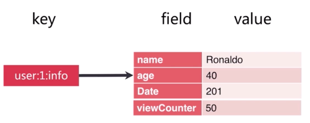

# redis

> + redis学习主要参考资料为[Redis入门视频教程_Redis学习视频教程](http://www.chilangedu.com/course/680324291.html#0) 

## 初识

### redis是什么

+ 开源

+ 基于键值对的存储服务系统

  > redis类似于数据库，以key-value形式存储数据

+ 支持多种数据结构

  > 字符串、hash table、linked list、sets、sorted sets等等

+ 性能高、功能丰富

### 特性

+ 速度快

  + 数据存在内存中
  + C语言实现
  + 单线程

+ 持久化

  > Redis 把所有数据保存在内存中，对数据的更新异步的保存在磁盘中

+ 多种数据结构

    

  基于以上数据结构，衍生支持了以下数据结构：

  + BitMaps：位图

    > 基于字符串

  + HyperLogLog：超小内存唯一值计数

    > 基于字符串

  + GEO：地理信息定位

    > 基于sorted sets

+ 支持多种编程语言

+ 功能丰富

  + 发布订阅

  + lua脚本

    > 实现自定义命令

  + 事务

  + pipeline

    > 提高客户端并发效率

+ 简单

+ 主从复制

    

+ 高可用、分布式

  + Redis-Sentinel(v2.8)支持高可用
  + Redis-Cluster(v3.0)支持分布式

### 典型使用场景

+ 缓存系统
+ 计数器
+ 消息队列系统
+ 排行榜
+ 社交网络
+ 实时系统

## 安装配置

### 安装

#### linux、Mac

+ 下载

  https://redis.io/download

+ 解压编译

  ```shell
  $ tar xzf redis-5.0.3.tar.gz
  $ cd redis-5.0.3
  $ make
  ```

  > 编译后并未将结果文件拷贝到其他位置，还在这个目录下，所以将这个目录拷贝到合适的位置，并配置环境变量，安装即可完成

+ 启动测试

  + 启动服务

    ```shell
    $ src/redis-server
    ```

  + 启动客户端

    ```shell
    $ redis-cli 
    127.0.0.1:6379> set hello world
    OK
    127.0.0.1:6379> get hello
    "world"
    ```

### 可执行文件说明

+ redis-server：redis服务器
+ redis-cli：redis命令行客户端
+ redis-benchmark：redis性能测试工具
+ redis-check-aof：aof文件修复工具
+ redis-check-rdb：rdb文件检查工具
+ redis-sentinel：sentinel服务器

### 启动方式

#### 服务端启动

+ 简单启动

  直接使用`redis-server`启动

+ 带参数启动

  redis默认端口为：6379

  使用6380启动：redis-server --port 6380

+ 配置文件启动

  + 编写配置文件`*.config`

  + 将配置文件作为第1个启动参数启动

    ```shell
    redis-server config/6380.conf
    ```

  > **redis启动参数及配置文件中的相对路径均是相对于执行启动命令的位置，所以使用相对路径时，需要到指定的目录下执行启动命令，最好尽量避免使用相对路径** 

#### 客户端启动

+ 以默认ip`localhost`默认端口`6379`启动

  ```shell
  $ redis-cli
  ```

+ 指定ip和端口启动

  ```shell
  $ redis-cli -h 127.0.0.1 -p 6380
  ```

### 配置

#### 查看与修改

+ 查看

  在客户端中

  使用`config get *`获取所有配置项

  使用`config get NAME`获取某个配置项，如：`CONFIG GET loglevel`

+ 修改配置

  在客户端中

  使用`config NAME VALUE`修改配置，如`config daemonize yes`

#### 配置项

> 所有配置项解释参见[Redis 3.2安装及主从复制详细配置](https://segmentfault.com/a/1190000006619753)，由于版本问题部分配置可能不同

+ port

  对外端口，默认6379

+ dir

  工作目录，一般使用绝对路径

+ logfile

  日志文件名

+ daemonize

  是否以守护进程方式启动，默认no，建议使用yes

  以守护进程启动时：

  + 执行启动命令后，服务将自动后台运行

  + 启动日志将打印到日志文件

#### 配置项总结

> 实际开发中，可以将redis默认配置文件`redis.conf`拷贝，并按如下内容对需要修改的配置进行修改后使用

```shell
port 6380												# redis服务端口
daemonize yes											# 是否以守护进行启动
pidfile /var/run/redis_${port}.pid						# pid文件名
logfile ${port}.log										# 日志文件名
# save 900 1											# 关闭RDB自动持久化
# save 300 10
# save 60 10000
dbfilename dump_${port}.rdb								# RDB文件名
dir /Users/will/tools/redis-5.0.3/data					# 日志文件路径
appendonly yes											# 启用AOF功能
appendfilename appendonly_${port}.aof					# AOF文件名
no-appendfsync-on-rewrite yes							# AOF文件重写时停止向AOF文件中写入
slowlog-log-slower-than 1000
slowlog-max-len 1000
```

> 注意将`${port}`替换为实际端口号

### 可视化客户端

+ redis desktop manager

  很出名，但是不免费

+ medis

  [Medis 0.6.0 Mac 破解版 – 漂亮易用的Redis管理应用](https://www.waitsun.com/medis-0-6-0.html) 

+ TreeNMS

  基于web的redis可视化工具，搭建在服务器上在哪都能用

+ RedisPlus

  目前用这个

  java开发的工具，有监控功能和集群管理功能

  连接参见：https://gitee.com/MaxBill/RedisPlus

  Mac版在这里没有下载链接，在qq群`857111033`里有下载

## API理解与使用

### 数据结构与内部编码

 

### 字符串

#### 介绍

- 可以保存哪些值
  - 字符串
  - 数字
  - 二进制
  - json、xml等字符串
- 使用场景
  - 缓存
  - 计数器
  - 分布式锁
  - ...

#### 命令

- get

  语法：get KEY

  功能：获取字符串类型的key对应的value

- incr

  语法：incr KEY

  功能：key自增1，如果key不存在，自增后key=1

- decr

  语法：decr KEY

  功能：key自减1，如果key不存在，自减后key=1

- incrby

  语法：incrby KEY N

  功能：key自增n，如果key不存在，自增后key=n

- decrby 

  语法：decrby KEY N

  功能：key自减n，如果key不存在，自减后key=-n

- set

  语法：set KEY VALUE

  功能：不管key是否存在，都进行设置

- setnx

  语法：setnx KEY VALUE

  功能：key不存在时，才进行设置

- set xx

  语法：set KEY VALUE xx

  功能：key存在时，才进行设置

- setex

  语法：setex KEY SECONDS VALUE

  功能：相当于如下两条命令

  ```shell
  SET key value
  EXPIRE key seconds
  ```

  设置1个key同时设置过期时间

- mset

  语法：mset KEY VALUE [KEY VALUE ...]

  功能：创建多个键值对

  ```shell
  127.0.0.1:6380> mset key1 value1 key2 value2
  OK
  127.0.0.1:6380> keys *
  1) "key2"
  2) "key1"
  ```

- mget

  语法：mget KEY [KEY ...]

  功能：获取多个key

  ```shell
  127.0.0.1:6380> mget key1 key2
  1) "value1"
  2) "value2"
  ```

- getset 

  语法：getset KEY VALUE

  将新值设置到key，并返回旧值

- append

  语法：append KEY VALUE

  功能：将值追加到原有字符串之后

  ```shell
  127.0.0.1:6380> get key1
  "haha"
  127.0.0.1:6380> append key1 haah
  (integer) 8
  127.0.0.1:6380> get key1
  "hahahaah"
  ```

- strlen

  语法：strlen KEY

  功能：返回字符串长度

  注意：中文占用2个字节

- incrbyfloat

  语法：incrbyfloat KEY N

  功能：浮点数key自增n

  ```shell
  127.0.0.1:6380> incrbyfloat key5 3.5
  "3.5"
  127.0.0.1:6380> get key5
  "3.5"
  ```

- getrange

  语法：getrange KEY START END

  功能：获取指定下标的值

  第1个字母的下标为0

  ```shell
  127.0.0.1:6380> get key2
  "value2"
  127.0.0.1:6380> getrange key2 2 3
  "lu"
  ```

- setrange

  语法：setrange KEY INDEX VALUE

  功能：将key对应的值的某个下标的值替换为新值

  ```shell
  127.0.0.1:6380> get key2
  "value2"
  127.0.0.1:6380> setrange key2 2 L
  (integer) 6
  127.0.0.1:6380> get key2
  "vaLue2"
  ```


### hash

#### 介绍

- 键值结构

   

  hash类型的结构相对于字符串多了1个属性`field`，该结构类似于`javabean`对象，key相当于对象，field相当于对象中属性，value相当于属性值

#### 命令

- hset

  语法：hset KEY FIELD VALUE

  功能：无论key或field是否存在，都设置key中的field属性对应的value

- hsetnx

  语法：hsetnx KEY FIELD VALUE

  功能：只有key或field不存在时，才设置key中的field属性对应的value

- hget

  语法：hget KEY FIELD

  功能：获取key中的field属性对应的value

- hdel

  语法：hdel KEY FIELD

  功能：删除key中的field属性

- hgetall

  语法：hgetall KEY

  功能：获取key中所有属性和值

- hexists

  语法：hexists KEY FIELD

  功能：查看key或key中的属性是否存在

- hlen

  语法：hlen KEY

  功能：查看key中field属性的数量

- hmget

  语法：hmget KEY FIELD [FIELD ... ]

  功能：获取key中多个field属性的值

- hmset

  语法：hmset KEY FIELD VALUE [FIELD VALUE ...]

  功能：批量设置key中的属性

- hgetall

  语法：hgetall KEY

  功能：获取key对应的所有的key和value

- hvals

  语法：hvals KEY

  功能：获取key对应的所有value

- hkeys

  语法：hkeys KEY

  功能：获取key对应的所有的field

- hincrby

  语法：hincrby KEY FIELD N

  功能：key中的field属性自增n

- hincrbyfloat

  语法：hincrbyfloat KEY FIELD F

  功能：key中的field属性自增浮点数f

### list

#### 介绍

- `key:list`结构

- list集合中的元素分别有正负2个下标

  长度为n的list，第1个元素的下标为0，同时也是-n；最后1个元素下标为n-1，同时也是-1

   

#### 命令

- rpush

  语法：rpush KEY VALUE [VALUE ...]

  功能：从列表右侧依次添加多个元素

  例：

  ```shell
  127.0.0.1:6380> rpush list2 a b c
  (integer) 3
  127.0.0.1:6380> lrange list2 0 -1
  1) "a"
  2) "b"
  3) "c"
  ```

- lpush

  语法：lpush KEY VALUE [VALUE ...]

  功能：从列表左侧依次添加多个元素

  例：

  ```shell
  127.0.0.1:6380> lpush list1 a b c
  (integer) 3
  127.0.0.1:6380> lrange list1 0 -1
  1) "c"
  2) "b"
  3) "a"
  ```

- linsert

  语法：linsert KEY before/after VALUE NEWVALUE

  功能：	在名为key的list集合的指定值value前/后插入新值newValue；

  ​		如果存在多个相同的value，则以从左至右第1个为准；

  ​		如果key或value不存在，则插入失败

  例

  ```shell
  127.0.0.1:6380> lrange list1 0 -1
  1) "a"
  2) "b"
  3) "c"
  4) "c"
  127.0.0.1:6380> linsert list1 after c d
  (integer) 5
  127.0.0.1:6380> lrange list1 0 -1
  1) "a"
  2) "b"
  3) "c"
  4) "d"
  5) "c"
  ```

- lpop

  语法：lpop KEY

  功能：从左边弹出(删除并返回)1个元素

  例

  ```shell
  127.0.0.1:6380> lrange list1 0 -1
  1) "a"
  2) "b"
  3) "c"
  4) "d"
  5) "c"
  127.0.0.1:6380> lpop list1
  "a"
  127.0.0.1:6380> lrange list1 0 -1
  1) "b"
  2) "c"
  3) "d"
  4) "c"
  ```

- blpop

  语法：blpop KEY [KEY ...] timeout

  功能：	lpop的阻塞版本

  ​		当key1、key2等集合中有不是空集合的集合时，立即返回该集合中的元素

  ​		   当key1、key2等均是空集合时，等待timeout秒，超时返回`nil`

  ​		等待过程中，当key1、key2等集合中任一集合有新元素时，立即返回该集合中的元素

  ​		当timeout=0时，表示一直阻塞

  例：

  ```shell
  127.0.0.1:6380> blpop list2 list3 10
  (nil)
  (10.07s)
  127.0.0.1:6380> blpop list2 list3 20
  1) "list2"
  2) "a"
  (12.90s)
  ```

  说明：当有新元素返回时，返回的第1个元素为集合名称，第2个元素才是真正要返回的元素

- rpop

  语法：rpop KEY

  功能：从右边弹出(删除并返回)1个元素

  例

  ```shell
  127.0.0.1:6380> lrange list1 0 -1
  1) "b"
  2) "c"
  3) "d"
  4) "c"
  127.0.0.1:6380> rpop list1
  "c"
  127.0.0.1:6380> lrange list1 0 -1
  1) "b"
  2) "c"
  3) "d"
  ```

- brpop

  跟`blpop`一个道理

- lrem

  语法：lrem KEY COUNT VALUE

  功能：	在名为key的list集合中删除值为value的元素

  ​		count>0时，从左到右，最多删除count个

  ​		count<0时，从右至左，最多删除count个

  ​		count=0时，删除全部

  例：

  ```shell
  127.0.0.1:6380> lrange list1 0 -1
  1) "a"
  2) "b"
  3) "c"
  4) "a"
  5) "b"
  6) "c"
  127.0.0.1:6380> lrem list1 2 a
  (integer) 2
  127.0.0.1:6380> lrange list1 0 -1
  1) "b"
  2) "c"
  3) "b"
  4) "c"
  ```

- ltrim

  语法：ltrim KEY START END

  功能：截取指定范围内的元素

  例：

  ```shell
  127.0.0.1:6380> lrange list2 0 -1
  1) "a"
  2) "b"
  3) "c"
  4) "d"
  5) "e"
  127.0.0.1:6380> ltrim list2 1 3
  OK
  127.0.0.1:6380> lrange list2 0 -1
  1) "b"
  2) "c"
  3) "d"
  ```

- lrange

  语法：lrange KEY START END

  功能：	获取指定范围内元素

  ​		结果包含下标为start和end的元素

  ​		  start代表的元素必须在end代表元素的左侧，否则报`list为空`

  例：

  ```shell
  127.0.0.1:6380> lrange list1 0 -1
  1) "a"
  2) "b"
  3) "c"
  4) "d"
  5) "e"
  127.0.0.1:6380> lrange list1 1 2
  1) "b"
  2) "c"
  127.0.0.1:6380> lrange list1 1 0
  (empty list or set)
  ```

- lindex

  语法：lindex KEY INDEX

  功能：获取key集合中下标为index的元素

- llen

  语法：llen KEY

  功能：获取list集合长度

- lset

  语法：lset KEY INDEX NEWVALUE

  功能：设置key集合中下标为index的值为newValue

  例：

  ```shell
  127.0.0.1:6380> lrange list1 0 -1
  1) "a"
  2) "b"
  3) "c"
  4) "d"
  5) "e"
  127.0.0.1:6380> lset list1 0 f
  OK
  127.0.0.1:6380> lrange list1 0 -1
  1) "f"
  2) "b"
  3) "c"
  4) "d"
  5) "e"
  ```

### set

#### 介绍

- Redis的Set是string类型的无序集合。集合成员是唯一的，这就意味着集合中不能出现重复的数据。

- Redis 中 集合是通过哈希表实现的，所以添加，删除，查找的复杂度都是O(1)。

#### 命令

- sadd

  语法：sadd KEY VALUE [VALUE ...]

  功能：将元素添加到名为key的set集合，如果没有则创建，如果集合已存在则将新元素追加到原有集合，如果新元素与旧元素存在重复，则忽略重复的新元素

  ```shell
  127.0.0.1:6380> sadd myset a b c
  (integer) 3
  127.0.0.1:6380> smembers myset
  1) "a"
  2) "c"
  3) "b"
  127.0.0.1:6380> sadd myset c d e
  (integer) 2
  127.0.0.1:6380> smembers myset
  1) "a"
  2) "c"
  3) "d"
  4) "b"
  5) "e"
  ```

- smembers

  语法：smembers KEY

  功能：查看set集合的值

- sinter

  语法：sinter KEY [KEY ...]

  功能：获取多个集合中的交集元素

- sdiff

  语法：sdiff KEY [KEY ...]

  功能：获取key1集合中有，其他集合中没有的元素

  例：

  ```shell
  127.0.0.1:6380> smembers set1
  1) "a"
  2) "c"
  3) "b"
  127.0.0.1:6380> smembers set2
  1) "e"
  2) "c"
  3) "d"
  127.0.0.1:6380> sdiff set1 set2
  1) "a"
  2) "b"
  127.0.0.1:6380> sdiff set2 set1
  1) "e"
  2) "d"
  ```

- sunion

  语法：sunion KEY [KEY ...]

  功能：获取key1、key2等集合的并集

- srem

  语法：srem KEY VALUE

  功能：删除集合中某元素

- scard

  语法：scard KEY

  功能：计算集合大小

- sismember

  语法：sismember KEY VALUE

  功能：判断集合key中是否存在元素value

- srandmember

  语法：srandmember KEY [COUNT]

  ​	count为可选参数，默认1

  功能：随机从集合key中取出count个元素（只取不删）

- spop

  语法：spop KEY 

  功能：从集合key中随机弹出1个元素（取出并删除）

### zset

#### 介绍

+ 有序集合由3部分构成

  key：{{element，score}，{element，score}，... }

  + key：与其他类型中的key相同
  + element：元素
  + score：分值，一般是数字类型，有序集合中的元素会按照分值进行排序（升序）

  例：

+ 集合VS有序集合

  + 都没有重复元素
  + 集合无序，有序集合按score的值进行排序
  + 有序集合时间复杂度普遍比集合高

+ 与[list](#list)一样，zset根据排序后的顺序，也有正负2个下标

#### 命令

- zadd

  语法：zadd KEY SCORE ELEMENT [SCORE ELEMENT ...]

  功能：向集合key中创建并添加元素

  例：

  ```shell
  127.0.0.1:6380> zadd zset1 1 math 2 english
  (integer) 2
  127.0.0.1:6380> zrange zset1 0 -1 withscores
  1) "math"
  2) "1"
  3) "english"
  4) "2"
  ```

- zrem

  语法：zrem KEY ELEMENT [ELEMENT ...]

  功能：删除key中的某几个元素

  例：

  ```shell
  127.0.0.1:6380> zrange zset1 0 -1 withscores
  1) "math"
  2) "1"
  3) "english"
  4) "2"
  127.0.0.1:6380> zrem zset1 math
  (integer) 1
  127.0.0.1:6380> zrange zset1 0 -1 withscores
  1) "english"
  2) "2"
  ```

- zscore

  语法：zscore KEY ELEMENT

  功能：获取key中element的分值

  例：

  ```shell
  127.0.0.1:6380> zscore zset1 english
  "2"
  ```

- zincrby

  语法：zincrby KEY N ELEMENT

  功能：将key中的element自增n

  例：

  ```shell
  127.0.0.1:6380> zrange zset1 0 -1 withscores
  1) "english"
  2) "2"
  127.0.0.1:6380> zincrby zset1 1 english
  "3"
  ```

- zcard

  语法：zcard KEY

  功能：获取key中元素总个数

- zrank

  语法：zrank KEY ELEMENT

  功能：获取key中元素element按升序排序的排名

  例：

  ```shell
  127.0.0.1:6380> zrank zset1 english
  (integer) 0
  ```

- zrange

  语法：zrange KEY START END [withscores]

  功能：按范围获取排序后第start到第end的元素，`withscores`为可选参数，表示是否打印分数

  例：

  ```shell
  127.0.0.1:6380> zrange zset1 0 -1 withscores
  1) "english"
  2) "3"
  127.0.0.1:6380> zrange zset1 0 -1
  1) "english"
  ```

- zrangebyscore

  语法：`zrangebyscore KEY MIN MAX [withscores] [limit OFFSET COUNT]`

  功能：返回指定分数范围内的升序元素[分数]

  参数：

  ​	  min、max：表示最小最大分数，默认使用闭区间，前面加上`(`来表示开区间

  ​	limit：同mysql的limit，对返回结果进行分页，从下表为offset的元素开始取count个元素作为最终结果

  例：

  ```shell
  127.0.0.1:6380> zrange zset1 0 -1 withscores
  1) "math"
  2) "2"
  3) "english"
  4) "3"
  5) "yw"
  6) "4"
  127.0.0.1:6380> zrangebyscore zset1 (2 (5 withscores limit 1 1
  1) "yw"
  2) "4"
  ```

- zcount

  语法：zcount KEY MIN MAX

  功能：获取指定分数范围内的元素个数

  参数：min、max：表示最小最大分数，默认使用闭区间，前面加上`(`来表示开区间

  例：

  ```shell
  127.0.0.1:6380> zcount zset1 (2 5
  (integer) 2
  ```

- zremrangebyrank

  语法：zremrangebyrank KEY START END

  功能：删除指定排名范围内的升序元素

  例：

  ```shell
  127.0.0.1:6380> zrange zset1 0 -1 withscores
  1) "math"
  2) "2"
  3) "english"
  4) "3"
  5) "yw"
  6) "4"
  127.0.0.1:6380> zremrangebyrank zset1 1 2
  (integer) 2
  127.0.0.1:6380> zrange zset1 0 -1 withscores
  1) "math"
  2) "2"
  ```

- zremrangebyscore

  语法：zremrangebyscore KEY MIN MAX

  功能：删除指定分数范围内的升序元素

  例：

  ```shell
  127.0.0.1:6380> zrange zset1 0 -1 withscores
   1) "math"
   2) "2"
   3) "yw"
   4) "3"
   5) "english"
   6) "4"
   7) "ty"
   8) "5"
   9) "ms"
  10) "6"
  127.0.0.1:6380> zremrangebyscore zset1 (3 (6
  (integer) 2
  127.0.0.1:6380> zrange zset1 0 -1 withscores
  1) "math"
  2) "2"
  3) "yw"
  4) "3"
  5) "ms"
  6) "6"
  ```

- zrevrank

  语法：zrevrank KEY ELEMENT

  功能：相对于`zrank`，获取某元素在集合中按降序排序的排名

  ```shell
  127.0.0.1:6380> zrange zset1 0 -1 withscores
  1) "math"
  2) "2"
  3) "yw"
  4) "3"
  5) "ms"
  6) "6"
  127.0.0.1:6380> zrank zset1 math
  (integer) 0
  127.0.0.1:6380> zrevrank zset1 math
  (integer) 2
  ```

- zrevrange

  语法：zrevrange KEY START END [withscores]

  功能：相对于`zrange`，按降序排序并获取指定排名范围内的元素

  例：

  ```shell
  127.0.0.1:6380> zrange zset1 0 -1 withscores
  1) "math"
  2) "2"
  3) "yw"
  4) "3"
  5) "ms"
  6) "6"
  127.0.0.1:6380> zrevrange zset1 0 -1 withscores
  1) "ms"
  2) "6"
  3) "yw"
  4) "3"
  5) "math"
  6) "2"
  ```

- zrevrangebyscore

  语法：`zrevrangebyscore KEY MAX MIN [withscores] [limit OFFSET COUNT]`

  功能：相对于`zrangebyscore`，按降序排序并获取指定分数范围内的元素

  参数：

  ​	 max、min：表示最大最小分数，默认使用闭区间，前面加上`(`来表示开区间

  ​		**注意：zrangebyscore中是min在前，zrevrangebyscore中是max在前**

  ​	limit：同mysql的limit，对返回结果进行分页，从下表为offset的元素开始取count个元素作为最终结果

  例：

  ```shell
  127.0.0.1:6380> zrange zset1 0 -1 withscores
  1) "math"
  2) "2"
  3) "yw"
  4) "3"
  5) "ms"
  6) "6"
  127.0.0.1:6380> zrevrangebyscore zset1 6 (2 withscores limit 1 1
  1) "yw"
  2) "3"
  ```

- zinterstore

  语法：`zinterstore DESTINATION NUMKEYS KEY [KEY ...][weights WEIGHT [WEIGHT ...]] [aggregate sum|min|max]`

  功能：获取多个集合的**交集**；redis会将乘以权重后的元素按照`aggregate`指定的聚合方式，**将所有集合中都存在的元素进行聚合**，并将得到结果并存储到`destination`集合中

  参数：

  - destination：聚合后的结果存储在该集合中，该集合不存在则创建，存在则更新
  - numkeys：后面需要进行聚合的集合`key`的数量，该值必须与后面集合数量一致
  - weights：指定权重，权重参数`weight`的数量必须与`numkeys`的值一致，并且权重参数的顺序就是前面集合`key`的权重的顺序；不指定该参数时默认为1；集合中的每个元素会与其对应的权重相乘后再进行聚合运算
  - aggregate：选择聚合方式，可选值为：sum：求和；min：取最小值；max：取最大值

  例：

  ```shell
  127.0.0.1:6380> zrange zset1 0 -1 withscores
  1) "math"
  2) "2"
  3) "yw"
  4) "3"
  5) "ms"
  6) "6"
  127.0.0.1:6380> zinterstore zset2 2 zset1 zset1 weights 0.5 0.5 aggregate min
  (integer) 3
  127.0.0.1:6380> zrange zset2 0 -1 withscores
  1) "math"
  2) "1"
  3) "yw"
  4) "1.5"
  5) "ms"
  6) "3"
  ```

- zunionstore

  语法：`zunionstore DESTINATION NUMKEYS KEY [KEY ...][weights WEIGHT [WEIGHT ...]] [aggregate sum|min|max]`

  功能：获取多个集合的并集；redis会将乘以权重后的元素按照`aggregate`指定的聚合方式，**将所有集合中的所有元素进行聚合**，并将得到结果并存储到`destination`集合中

  参数：参见`zinterstore`

  例：

  ```shell
  127.0.0.1:6380> zadd z1 1 a 2 b 3 c
  (integer) 3
  127.0.0.1:6380> zadd z2 3 b 4 c 5 d
  (integer) 3
  127.0.0.1:6380> zunionstore z4 2 z1 z2 weights 0.5 0.5 aggregate min
  (integer) 4
  127.0.0.1:6380> zrange z4 0 -1 withscores
  1) "a"
  2) "0.5"
  3) "b"
  4) "1"
  5) "c"
  6) "1.5"
  7) "d"
  8) "2.5"
  ```

### 其他命令

#### 配置命令

+ config get ...

  功能：获取redis配置参数

  例：

  ```shell
  127.0.0.1:6380> config get slowlog-log-slower-than
  1) "slowlog-log-slower-than"
  2) "10000"
  ```

+ config set ...

  功能：动态配置redis参数

  例：

  ```shell
  127.0.0.1:6380> config set slowlog-log-slower-than 1000
  OK
  127.0.0.1:6380> config get slowlog-log-slower-than
  1) "slowlog-log-slower-than"
  2) "1000"
  ```

#### 通用命令

+ keys

  语法：keys PATTERN

  功能：查看当前节点中，所有符合条件的key

  参数：PATTERN：使用`*`作为匹配符，如匹配`c`开头的key，则`keys c*`

  > 因为keys命令会对所有的key进行扫描，所以会影响性能，不建议在生产环境使用

+ dbsize

  语法：dbsize

  功能：查看一共有多少个key

+ exists

  语法：exists KEY

  功能：查看key是否存在

+ del

  语法：del KEY [KEY ...]

  功能：删除多个key

+ expire

  语法：expire KEY SECONDS

  功能：设置某个KEY在SECONDS秒后过期

+ ttl

  语法：ttl KEY

  功能：查看某个KEY剩余过期时间

+ persist

  语法：persist KEY

  功能：取消某个key的过期时间

+ type

  语法：type KEY

  功能：查看KEY的类型

+ flushall

  功能：清除所有数据

+ debug reload

  功能：调试模式重启，重启过程中会自动生成RDB文件，但是不会丢失内存中数据

+ shutdown

  功能：停止服务，会生成RDB文件

+ info memory

  功能：查看redis内存使用情况

+ exit

  功能：退出redis客户端

+ info [SECTION]

  功能：查看系统运行信息

  参数：SECTION：要查看的选项，可取值为下面结果中模块名称

  例:

  ```shell
  127.0.0.1:6380> info
  # Server
  redis_version:5.0.3
  redis_git_sha1:00000000
  redis_git_dirty:0
  redis_build_id:a564c1f0b077b2d3
  redis_mode:standalone
  os:Darwin 18.2.0 x86_64
  arch_bits:64
  multiplexing_api:kqueue
  atomicvar_api:atomic-builtin
  gcc_version:4.2.1
  process_id:99692
  run_id:88923f517a96c7e07f90f034823d45c88c96d594
  tcp_port:6380
  uptime_in_seconds:7656
  uptime_in_days:0
  hz:10
  configured_hz:10
  lru_clock:4648315
  executable:/Users/will/tools/redis-5.0.3/config/redis-server
  config_file:/Users/will/tools/redis-5.0.3/config/6380.conf
  
  # Clients
  connected_clients:1
  client_recent_max_input_buffer:2
  client_recent_max_output_buffer:0
  blocked_clients:0
  
  # Memory
  used_memory:1040288
  used_memory_human:1015.91K
  used_memory_rss:2101248
  used_memory_rss_human:2.00M
  used_memory_peak:1040288
  used_memory_peak_human:1015.91K
  used_memory_peak_perc:100.15%
  used_memory_overhead:1036686
  used_memory_startup:986992
  used_memory_dataset:3602
  used_memory_dataset_perc:6.76%
  allocator_allocated:1005456
  allocator_active:2063360
  allocator_resident:2063360
  total_system_memory:8589934592
  total_system_memory_human:8.00G
  used_memory_lua:37888
  used_memory_lua_human:37.00K
  used_memory_scripts:0
  used_memory_scripts_human:0B
  number_of_cached_scripts:0
  maxmemory:0
  maxmemory_human:0B
  maxmemory_policy:noeviction
  allocator_frag_ratio:2.05
  allocator_frag_bytes:1057904
  allocator_rss_ratio:1.00
  allocator_rss_bytes:0
  rss_overhead_ratio:1.02
  rss_overhead_bytes:37888
  mem_fragmentation_ratio:2.09
  mem_fragmentation_bytes:1095792
  mem_not_counted_for_evict:0
  mem_replication_backlog:0
  mem_clients_slaves:0
  mem_clients_normal:49694
  mem_aof_buffer:0
  mem_allocator:libc
  active_defrag_running:0
  lazyfree_pending_objects:0
  
  # Persistence
  loading:0
  rdb_changes_since_last_save:0
  rdb_bgsave_in_progress:0
  rdb_last_save_time:1548144565
  rdb_last_bgsave_status:ok
  rdb_last_bgsave_time_sec:0
  rdb_current_bgsave_time_sec:-1
  rdb_last_cow_size:0
  aof_enabled:1
  aof_rewrite_in_progress:0
  aof_rewrite_scheduled:0
  aof_last_rewrite_time_sec:-1
  aof_current_rewrite_time_sec:-1
  aof_last_bgrewrite_status:ok
  aof_last_write_status:ok
  aof_last_cow_size:0
  aof_current_size:0
  aof_base_size:0
  aof_pending_rewrite:0
  aof_buffer_length:0
  aof_rewrite_buffer_length:0
  aof_pending_bio_fsync:0
  aof_delayed_fsync:0
  
  # Stats
  total_connections_received:2
  total_commands_processed:6
  instantaneous_ops_per_sec:0
  total_net_input_bytes:186
  total_net_output_bytes:23652
  instantaneous_input_kbps:0.00
  instantaneous_output_kbps:0.00
  rejected_connections:0
  sync_full:0
  sync_partial_ok:0
  sync_partial_err:0
  expired_keys:0
  expired_stale_perc:0.00
  expired_time_cap_reached_count:0
  evicted_keys:0
  keyspace_hits:0
  keyspace_misses:0
  pubsub_channels:0
  pubsub_patterns:0
  latest_fork_usec:699
  migrate_cached_sockets:0
  slave_expires_tracked_keys:0
  active_defrag_hits:0
  active_defrag_misses:0
  active_defrag_key_hits:0
  active_defrag_key_misses:0
  
  # Replication
  role:master
  connected_slaves:0
  master_replid:7ad1d6bca0257a289911c49d75b9d8911382a002
  master_replid2:0000000000000000000000000000000000000000
  master_repl_offset:0
  second_repl_offset:-1
  repl_backlog_active:0
  repl_backlog_size:1048576
  repl_backlog_first_byte_offset:0
  repl_backlog_histlen:0
  
  # CPU
  used_cpu_sys:18.877357
  used_cpu_user:5.989598
  used_cpu_sys_children:0.001807
  used_cpu_user_children:0.000712
  
  # Cluster
  cluster_enabled:0
  
  # Keyspace
  ```


## java使用redis

### jedis

#### 简介

jedis是基于java开发的redis客户端，用户通过java使用redis

#### 使用

> 参见[helloworld](./helloworld) 

+ 依赖

  ```xml
  <dependency>
      <groupId>redis.clients</groupId>
      <artifactId>jedis</artifactId>
      <version>3.0.1</version>
  </dependency>
  ```

+ 使用

  ```java
  @Test
  public void test(){
      // 创建连接
      Jedis jedis = new Jedis("127.0.0.1",6380);
      // 执行命令
      Set<String> keys = jedis.keys("*");
      System.out.println(keys);
  }
  ```

### springboot使用redis

> + 资料参见：[【SpringBoot2.0系列07】SpringBoot之redis使用（Lettuce版本）](https://www.jianshu.com/p/feef1421ab0b) 
>
> + `Springboot1.x`中使用的是`jedis`，`springboot2.x`中使用的是`Lettuce`

#### Lettuce与jedis区别

+ Lettuce 和 Jedis 的定位都是Redis的client，所以他们当然可以直接连接redis server。

+ Jedis在实现上是直接连接的redis server，如果在多线程环境下是非线程安全的，这个时候只有使用连接池，为每个Jedis实例增加物理连接

+ Lettuce的连接是基于Netty的，连接实例（StatefulRedisConnection）可以在多个线程间并发访问，应为StatefulRedisConnection是线程安全的，所以一个连接实例（StatefulRedisConnection）就可以满足多线程环境下的并发访问，当然这个也是可伸缩的设计，一个连接实例不够的情况也可以按需增加连接实例。

####   代码

> demo参见[bootdemo](./bootdemo) 

+ 依赖

  ```xml
  <dependency>
      <groupId>org.springframework.boot</groupId>
      <artifactId>spring-boot-starter-data-redis</artifactId>
  </dependency>
  <dependency>
      <groupId>org.apache.commons</groupId>
      <artifactId>commons-pool2</artifactId>
  </dependency>
  ```

+ application.properties

  ```properties
  spring.redis.host=127.0.0.1
  spring.redis.port=6380
  # 密码，没有可以不填
  spring.redis.password=
  # 最大活跃链接数，默认为8
  spring.redis.lettuce.pool.max-active=8
  # 最大空闲链接数，默认为8
  spring.redis.lettuce.pool.max-idle=8
  # 最小空闲链接数，默认为0
  spring.redis.lettuce.pool.min-idle=0
  ```

+ RedisConfig

  > 配置redis的`key`和`value`的序列化方式
  >
  > + 默认使用的是`JdkSerializationRedisSerializer`，但是该序列化方式使用其他客户端查看时会出现乱码
  > + 网上有人说设置`key`的序列化方式为`StringRedisSerializer`，`value`的序列化方式为`Jackson2JsonRedisSerializer`，这样确实可以解决乱码问题，但是因为`key`的序列化方式为`StringRedisSerializer`，该类只能接受`String`类型的`key`，**后面mybatis使用redis做二级缓存时会将对象作为key传入，造成类型转换异常**，所以`key`的序列化方式应该设置为可以接受对象的方式（参见[Spring整合Redis报ClassCastException](https://blog.csdn.net/yz357823669/article/details/83245739)）
  >
  > + 根据[RedisTemplate系列化器之GenericJackson2JsonRedisSerializer](https://blog.csdn.net/u010180738/article/details/79383246)中的描述，`Jackson2JsonRedisSerializer`序列化`List`时也会出现类型转换异常，该文中推荐使用`GenericJackson2JsonRedisSerializer`。
  > + 综上，我们将`RedisTemplate`的4个序列化方式均设置为`GenericJackson2JsonRedisSerializer`,代码如下，`RedisSerializer.json()`返回的就是`GenericJackson2JsonRedisSerializer`

  ```java
  @Configuration
  @AutoConfigureAfter(RedisAutoConfiguration.class)
  public class RedisConfig {
      /**
       * 配置自定义redisTemplate
       * @return redis实例
       */
      @Bean
      RedisTemplate<String, Object> redisTemplate(RedisConnectionFactory redisConnectionFactory) {
  
          RedisTemplate<String, Object> template = new RedisTemplate<>();
          template.setConnectionFactory(redisConnectionFactory);
  
          template.setKeySerializer(RedisSerializer.json());
          template.setHashKeySerializer(RedisSerializer.json());
          template.setValueSerializer(RedisSerializer.json());
          template.setHashValueSerializer(RedisSerializer.json());
          template.afterPropertiesSet();
          return template;
      }
  }
  ```

+ Test

  ```java
  @RunWith(SpringRunner.class)
  @SpringBootTest
  public class BootdemoApplicationTests {
      @Autowired
      private RedisTemplate<String,Object> redisTemplate;
      @Test
      public void redisTest(){
          redisTemplate.opsForValue().set("tom",new UserDto("tom","123456"));
          UserDto tom = (UserDto)redisTemplate.opsForValue().get("tom");
          System.out.println(tom);
      }
  }
  ```

#### API

RedisTemplate中定义了一些通用命令对应的api

另外RedisTemplate中定义了针对redis中各种数据类型对应api

```java
redisTemplate.opsForValue();//操作字符串
redisTemplate.opsForHash();//操作hash
redisTemplate.opsForList();//操作list
redisTemplate.opsForSet();//操作set
redisTemplate.opsForZSet();//操作有序set
redisTemplate.opsForGeo();//操作地理空间
redisTemplate.opsForHyperLogLog();//操作HyperLogLog
```

##### 通用api

更多`RedisTemplate`的api参见[如何使用RedisTemplate访问Redis数据结构](https://www.jianshu.com/p/7bf5dc61ca06/) 

##### execute与executePipelined

> 资料参见[RedisTemplate：execute与executePipelined](https://yq.aliyun.com/articles/648282) 

## redis其他功能

### 慢查询

#### 生命周期

客户端执行1条命令的声名周期如下：

1. 客户端发送命令
2. 命令在服务器端排队
3. 执行命令
4. 返回结果

 

#### 什么是慢查询

​	慢查询功能是帮助运维人员定位系统存在的慢操作的

​	当服务端在执行每条命令时，都会计算每条命令的执行时间，当执行时间超过预设阈值时，就会将现场信息记录到慢查询日志的队列中，方便运维人员查看并进行维护

#### 配置参数

+ 配置项

  + slowlog-log-slower-than

    用于设置预设阈值，单位微秒，默认10000

    当单条命令执行时间超过该值时就会被记录到慢查询日志

    一般设置为1000即可

  + slowlog-max-len

    用于设置慢查询日志队列长度，表示最多可以记录多少条记录

    当队列已满时会将最前面的记录顶出，并记录最新记录

    一般设置为1000即可

+ 配置方式

  + 配置文件

    在redis配置文件中添加如下配置

    ```config
    slowlog-log-slower-than 1000
    slowlog-max-len 1000
    ```

  + 动态配置

    在客户端中可以使用命令动态配置

    ```shell
    127.0.0.1:6380> config set slowlog-log-slower-than 1000
    OK
    127.0.0.1:6380> config set slowlog-max-len 1000
    OK
    127.0.0.1:6380> config get slowlog-log-slower-than
    1) "slowlog-log-slower-than"
    2) "1000"
    127.0.0.1:6380> config get slowlog-max-len
    1) "slowlog-max-len"
    2) "1000"
    ```

#### 慢查询日志访问与管理

+ slowlog get [N]

  功能：获取N条慢查询日志记录

  参数：N：可选，没有代表获取所有

  例：

  ```shell
  127.0.0.1:6380> slowlog get 1
  1) 1) (integer) 3
     2) (integer) 1547625469
     3) (integer) 1164
     4) 1) "slowlog"
        2) "get"
     5) "127.0.0.1:51381"
     6) ""
  ```

+ slowlog len

  功能：获取慢查询日志队列当前长度

  例：

  ```shell
  127.0.0.1:6380> slowlog len
  (integer) 4
  ```

+ slowlog reset

  功能：重置慢查询日志队列

  例：

  ```shell
  127.0.0.1:6380> slowlog len
  (integer) 4
  127.0.0.1:6380> slowlog reset
  OK
  127.0.0.1:6380> slowlog len
  (integer) 0
  ```

#### 日志组成

通过`slowlog get 1`命令查询出一条慢查询日志记录，其结果含义如下：

```shell
127.0.0.1:6380> slowlog get 1
1) 1) (integer) 3					# 慢查询日志队列中该条记录的id
   2) (integer) 1547625469			# 时间戳
   3) (integer) 1164				# 命令实际耗时us
   4) 1) "slowlog"					# 命令
      2) "get"
   5) "127.0.0.1:51381"				# 客户端ip+port
   6) ""							
```

#### 慢查询日志持久化

​	当慢查询中记录较多时可能会丢失记录，可以定时执行`slowlog get`+`slowlog reset`命令将记录持久化到mysql等数据库中

### pipeline

#### 什么是pipeline

​	客户端执行1条命令的时间是`1次往返的网络时间`+ `1次命令执行时间`，当我们批量执行n条命令时，耗时就是`n次往返的网络时间`+ `n次命令执行时间`，相对于命令执行时间，网络时间是非常慢的，所以我们可以对这`n次往返的网络时间`进行优化

​	pipeline就是将这n条命令进行打包，一次性发给服务端，服务端执行完这n条命令后一次性按顺序返回所有结果，这样的耗时是`1次往返的网络时间`+ `n次命令执行时间`

#### springboot使用

> 参考资料：
>
> + [RedisTemplate使用PipeLine的总结](https://blog.csdn.net/xiaoliu598906167/article/details/82218525) 
>
>   其中关于最后的自动序列化为需要的类型没有成功

demo如下：

```java
@Test
public void pipelineTest(){
    List<Object> list = redisTemplate.executePipelined(new RedisCallback<Object>() {
        @Nullable
        @Override
        public Object doInRedis(RedisConnection connection) throws DataAccessException {
            for (int i = 0; i < 100; i++) {
                connection.get("tom".getBytes());
            }
            return null;
        }
    });
    System.out.println(list);
}
```

在doInRedis中返回值**必须**返回为null，`executePipelined`方法源码如下：

```java
@Override
public List<Object> executePipelined(RedisCallback<?> action, @Nullable RedisSerializer<?> resultSerializer) {

    return execute((RedisCallback<List<Object>>) connection -> {
        connection.openPipeline();
        boolean pipelinedClosed = false;
        try {
            Object result = action.doInRedis(connection);
            // 如果返回值为非空，则会抛出异常
            if (result != null) {
                throw new InvalidDataAccessApiUsageException(
                    "Callback cannot return a non-null value as it gets overwritten by the pipeline");
            }
            List<Object> closePipeline = connection.closePipeline();
            pipelinedClosed = true;
            return deserializeMixedResults(closePipeline, resultSerializer, hashKeySerializer, hashValueSerializer);
        } finally {
            if (!pipelinedClosed) {
                connection.closePipeline();
            }
        }
    });
}
```

#### pipeline与m命令区别

​	m命令（如：mset）是1个原子命令，而pipeline是将一对命令打包发送到服务端，在服务端队列中依然是这些命令排队执行的

### 发布订阅

#### 角色

+ 发布者（publisher）
+ 订阅者（subscriber）
+ 频道（channel）

发布者将消息发布到不同的频道中，订阅了不同频道的订阅者就会收到对应频道发布的消息

#### 命令

+ publish

  语法：publish CHANNEL MESSAGE

  功能：将消息message发布到channel频道

  例：

  ```shell
  127.0.0.1:6380> publish ch1 hello
  (integer) 0
  ```

  返回值是该频道订阅者个数

+ subscribe

  语法：subscrib CHANNEL [CHANNEL ...]

  功能：订阅多个频道

  例：

  ```shell
  127.0.0.1:6380> subscribe ch1
  Reading messages... (press Ctrl-C to quit)
  1) "subscribe"
  2) "ch1"
  3) (integer) 1
  1) "message"
  2) "ch1"
  3) "hello"
  ```

  执行该命令后该客户端一直处于监听状态，当频道中有新消息时就会接收到该消息

+ unsubscribe

  语法：unsubscrib CHANNEL [CHANNEL ...]

  功能：取消订阅多个频道

+ psubscribe

  语法：psubscrib PATTERN [PATTERN ...]

  功能：订阅匹配到的所有频道，表达式可以为多个

  参数：PATTERN：使用`*`作为匹配符

  例：订阅`c`开头的频道

  ```shell
  127.0.0.1:6380> psubscribe c*
  Reading messages... (press Ctrl-C to quit)
  1) "psubscribe"
  2) "c*"
  3) (integer) 1
  1) "pmessage"
  2) "c*"
  3) "ch1"
  4) "hello"
  ```

+ punsubscribe

  语法：punsubscribe PATTERN [PATTERN ...]

  功能：取消订阅匹配到的所有频道，表达式可以为多个

  参数：PATTERN：使用`*`作为匹配符

+ pubsub channels

  功能：列出至少有1个订阅者的频道，使用`psubscribe`命令订阅的频道不会列出

  例：

  ```shell
  127.0.0.1:6380> pubsub channels
  1) "ch1"
  ```

+ pubsub numsub CHANNEL [CHANNEL ...]

  功能：列出给定频道的订阅者数量

  例：

  ```shell
  127.0.0.1:6380> pubsub numsub ch1 ch2
  1) "ch1"
  2) (integer) 1
  3) "ch2"
  4) (integer) 0
  ```

+ pubsub numpat

  功能：列出使用`psubscribe`命令订阅的频道数量（`c*`这样的算1个）

### bitMap

#### 介绍

+ 对于`字符串类型`的数据，我们可以直接操作其二进制形式存储的数据中的每一位(bit)，这就是位图操作

  ```shell
  127.0.0.1:6380> set bit1 hello
  OK
  127.0.0.1:6380> getbit bit1 2
  (integer) 1
  ```

#### 命令

+ setbit

  语法：setbit KEY OFFSET VALUE

  功能：将KEY的value值的二进制数据的下标为OFFSET的位设置为VALUE

  例：

  ```shell
  127.0.0.1:6380> get bit3
  (nil)
  127.0.0.1:6380> setbit bit3 0 1
  (integer) 0
  127.0.0.1:6380> get bit3
  "\x80"
  ```

+ getbit

  语法：getbit KEY OFFSET

  功能：获取KEY的value值的二进制数据的下标为OFFSET的位

  例：

  ```shell
  127.0.0.1:6380> getbit bit3 0
  (integer) 1
  ```

+ bitcount

  语法：bitcount KEY [START END]

  功能：获取KEY的value值的二进制数据（指定字节范围内，未指定则获取全部）位值为1的位数

  参数：START、END：单位为字节

  例：

  ```shell
  redis> get tom
  hello
  redis> bitcount tom 0 1
  7
  ```

  > 统计`he`的二进制数据的位值为1的位数

+ bitop

  语法：bitop and/or/not/xor DESTKEY KEY [KEY ... ]

  功能：以字节为单位，对单个或多个key进行与、或、非、异或操作，将结果存在DESTKEY中

  例：

  ```shell
  # and
  # b1:0011 b2:1001
  127.0.0.1:6380> bitop and b3 b1 b2
  (integer) 1
  # b3:0001
  
  # or
  # b1:0011 b2:1001
  127.0.0.1:6380> bitop or b3 b1 b2
  (integer) 1
  # b3:1011
  
  # not
  # b1:1000000010000000 not操作只能有1个输入key
  127.0.0.1:6380> bitop not b3 b1
  (integer) 2
  # b3:0111111101111111 这里可以证明是按字节操作的
  
  # xor
  # b1:0011 b2:1001
  127.0.0.1:6380> bitop xor b3 b1 b2
  (integer) 1
  # b3:1010
  ```

+ bitpos

  语法：bitpos KEY BIT [START [END]]

  功能：从KEY的value值的指定字节范围内的值的二进制数据中获取到第1个值等于BIT的位的索引

  参数：START、END：都不指定时代表所有字节；也可以仅指定START，也可以同时指定START和END

  例：

  ```shell
  # b1: 01000000 01000000
  127.0.0.1:6380> bitpos b1 1 0
  (integer) 1
  127.0.0.1:6380> bitpos b1 1 1 -1
  (integer) 9
  ```

#### 用途

+ 需求：独立用户统计

  某网站有1亿用户，每天活跃用户大约5千万，需要统计每天哪些用户是活跃的

+ 方案

  + 使用set集合统计
  + 使用位图

+ 占用内存对比

  + set

    用户id是32位的，占用内存约`32 * 50000000 = 200M`

  + bitmap

    使用位标记统计，如id为12345的用户是活跃的，则将第12345位置1

    占用字节只与用户总数有关：`1 + 100000000 = 12.5M`

+ 分析

  ​	位图也不总是节省内存，当用户总数一定时，每天活跃用户量越少set集合越节省内存；每天活跃用户越多，bitmap越节省内存

### HyperLogLog

#### 简介

+ 基于HyperlogLog算法，极小空间完成独立数量统计
+ 本质还是字符串

#### 命令

+ pfadd

  语法：pfadd KEY VALUE [VALUE ...]

  功能：向KEY中添加元素，已添加过得元素将忽略

+ pfcount

  语法：pfcount KEY [KEY ...]

  功能：将多个key去重后统计一共有多少个元素

  例：

  ```shell
  127.0.0.1:6380> pfadd pf1 a b
  (integer) 1
  127.0.0.1:6380> pfadd pf2 b c
  (integer) 1
  127.0.0.1:6380> pfcount pf1 pf2
  (integer) 3
  ```

+ pfmerge

  语法：pfmerge DESTKEY SOURCEKEY [SOURCEKEY ...]

  功能：合并多个SOURCEKEY到DESTKEY，自动去重

  例：

  ```shell
  127.0.0.1:6380> pfadd pf1 a b
  (integer) 1
  127.0.0.1:6380> pfadd pf2 b c
  (integer) 1
  127.0.0.1:6380> pfmerge pf3 pf1 pf2
  OK
  127.0.0.1:6380> pfcount pf3
  (integer) 3
  ```

#### 优缺点

+ 占用内存极小，存储一百万用户的用户统计，只需要越15K
+ 存在误差，约`0.81%`

### GEO

#### 什么是GEO

+ 用于计算地理位置信息（经纬度）
+ 本质是zset
+ 需要删除地理位置时，可以使用zset的相关命令来操作geo

#### 命令

+ geoadd

  语法：geoadd KEY LONGITUDE LATITUDE MEMBER [ LONGITUDE LATITUDE MEMBER ...]

  功能：向集合KEY中添加多个地理位置信息，标识为MEMBER，经度为LONGITUDE，维度为LATITUDE

  例：

  ```shell
  127.0.0.1:6380> geoadd cities 11.2 22.3 beijing
  (integer) 1
  ```

+ geopos

  语法：geopos KEY MEMBER [MEMBER ...]

  功能：获取KEY中多个标识的经纬度信息

  例：

  ```shell
  127.0.0.1:6380> geopos cities beijing tianjian
  1) 1) "11.20000094175338745"
     2) "22.29999896492555678"
  2) 1) "22.19999760389328003"
     2) "33.2999993523012634"
  ```

+ geodist

  语法：geodist KEY MEMBER1 MEMBER2 [UNIT]

  功能：计算两个位置之间的距离

  参数：UNIT：指定单位，可取值为：m(米)、km(千米)、mi(英里)、ft(尺)；默认单位为`米`

  例：

  ```shell
  127.0.0.1:6380> geodist cities beijing tianjian 
  "1631210.1939"
  127.0.0.1:6380> geodist cities beijing tianjian m
  "1631210.1939"
  ```

+ georadius

  语法：`georadius KEY LONGITUDE LATITUDE RADIUS UNIT [withcoord] [withdist] [withhash] [count COUNT] [asc/desc] [store KEY1] [storedist KEY2]`

  功能：获取集合KEY中指定位置（LONGITUDE LATITUDE）半径RADIUS内的位置的地理位置信息

  参数：

  + KEY：要从哪个集合中获取位置
  + LONGITUDE LATITUDE：指定的经纬度
  + RADIUS：半径
  + UNIT：半径单位；m(米)、km(千米)、mi(英里)、ft(尺)
  + withcoord：返回结果中包含经纬度
  + withdist：返回结果中包含距离中心节点的距离
  + withhash：返回结果中包含geohash
  + count COUNT：指定返回结果数量
  + asc/desc：指定按距离中心节点距离排序规则，默认升序
  + store KEY1：将返回结果地理位置信息保存在KEY1
  + storedist KEY2：将返回结果距离中心节点的距离信息保存在KEY2

  例：

  ```shell
  127.0.0.1:6380> georadius cities 11.2 22.3 2000 km withdist
  1) 1) "beijing"
     2) "0.0002"
  2) 1) "tianjian"
     2) "1631.2102"
  ```

+ georadiusbymember

  语法：`georadiusbymember KEY MEMBER RADIUS UNIT [withcoord] [withdist] [withhash] [count COUNT] [asc/desc] [store KEY1] [storedist KEY2]`

  功能：与`georadius`一样，只不过将指定的经纬度换成了指定的`member`

### 内存管理

> redis本身有一套内存管理机制，可以设置单个redis服务可以使用内存的最大值，当达到这个值时，则需要按照指定的策略对内存进行回收，配置参数如下：

+ maxmemory

  可以使用的最大内存，达到该值时使用内存管理策略，单位是字节，默认不设置最大值

+ maxmemory-policy

  内存管理策略，可选值如下：

  + volatile-lru：

    尝试回收最少使用的键，但仅限于在已设置过期集合的键。 

  + allkeys-lru

    尝试回收最少使用的键

  + volatile-lfu

    在已设置过期的数据集中选择最近最不常使用的数据淘汰

  + allkeys-lfu

    从数据集中挑选最近最不常使用的数据淘汰。

  + volatile-random

    回收随机的键，仅限于在已设置过期集合的键。

  + allkeys-random

    回收随机的键

  + volatile-ttl

    回收过期集合的键，并且优先回收存活时间较短的键，使得新添加的数据有地方可存放。

  + neoviction

    禁止驱逐数据（默认）；当内存达到限制时并且客户端尝试执行一些消耗内存的命令时返回错误，即OOM异常。

  > lfu与lru算法类似，不过lfu更新，这里不必纠结两者区别

## 持久化

redis持久化有2种方式：RDB、AOF

### RDB

#### 介绍

+ 以快照的形式持久化

+ 当以某种方式触发了redis的RDB持久化时，redis会将内存中所有数据保存到RDB文件中，以后可以使用该文件进行数据恢复

+ RDB文件位置为redis配置参数中`dir`指定的路径

  对于`save`、`bgsave`，每次进行持久化时新文件会替代老文件

  对于

#### 触发方式

+ 同步

  使用`save`命令实时同步进行备份，命令执行期间其他命令会被阻塞

  例：

  ```shell
  127.0.0.1:6380> save
  OK
  ```

+ 异步

  使用`bgsave`命令异步进行后台备份，控制台立即返回`ok`，后台单独开启线程进行备份

  例：

  ```shell
  127.0.0.1:6380> bgsave
  Background saving started
  ```

+ 自动

  + 我们可以在redis配置文件中配置自动触发方式的触发条件，相关配置如下：

    ```shell
    # 以下条件满足其一即触发自动备份
    save 900 1			# 满足每900秒有1次更改
    save 300 10			# 满足每300秒有10次更改
    save 60 10000		# 满足每60秒有10000次更改
    ```

  + 当满足自动备份触发条件时，redis会自动执行`bgsave`命令启动后台备份

  + 其他相关配置

    ```shell
    dbfilename dump.rdb					# 备份文件名
    dir ./								# 备份、日志等文件存储路径
    stop-writes-on-bgsave-error yes 	# 发生错误时停止备份
    rdbcompression yes					# 备份时是否压缩
    rdbchecksum yes						# 是否使用校验和
    ```

+ 对比

  + save对比bgsave

    |   命令   |       save       |       bgsave       |
    | :------: | :--------------: | :----------------: |
    |  IO类型  |       同步       |        异步        |
    | 是否阻塞 |        是        |     fork时阻塞     |
    |  复杂度  |       O(n)       |        O(n)        |
    |   优点   | 不会消耗额外内存 | 不会阻塞客户端命令 |
    |   缺点   |  阻塞客户端命令  | 需要fork，消耗内存 |

  + 自动触发

    自动触发策略的缺点是，无法控制备份频率，所以一般在线上不会使用自动备份

+ 其他触发方式

  + 全量复制

  + debug reload

    调试模式重启，不丢失内存中数据

  + shutdown

#### 最佳配置

```shell
# 关闭自动备份
# save 900 1			
# save 300 10			
# save 60 10000
dbfilename dump-${port}.rdb					# 备份文件名，使用端口号进行区分
dir /usr/local/redis/data/					# 备份、日志等文件存储路径，使用绝对路径
stop-writes-on-bgsave-error yes 			# 发生错误时停止备份
rdbcompression yes							# 备份时是否压缩
rdbchecksum yes								# 是否使用校验和
```

### AOF

#### 介绍

+ RDB现存问题

  + 耗时耗性能

    每次备份全部数据，fork时消耗很多内存

  + 不可控、丢失数据

    一次`save`后突然宕机，没来得及做第二次备份，则会丢失数据

+ AOF原理

  + 创建

    当每次对redis进行更改时，在日志文件中记录一次操作

  + 恢复

    当redis重启时，将AOF文件重新载入到redis中

#### 三种策略

AOF持久化时，数据从内存中持久化到AOF文件中经历了如下过程：

+ 执行每条命令时，将命令写到缓冲区
+ 将缓冲区数据写到AOF文件中

 

这里的`三种策略`指的就是将缓存中数据何时写到AOF文件中的三种策略

+ always

  每次将命令写入到缓存中时都直接将其写入到AOF文件

  + 优点：不会丢失任何数据
  + 缺点：频繁的IO影响性能

+ everysec

  每秒执行1次将缓存中数据写入到AOF文件

  该值为默认值

  + 优点：适当的降低了对IO的读写次数，提升性能
  + 缺点：发生故障时会丢失1秒数据

+ no

  何时将缓存中数据写入到AOF文件由操作系统决定，redis不进行干涉

#### AOF重写

+ 什么是AOF重写

  将AOF文件中命令进行整理，只保持最终结果一致

  如：

  ```shell
  set hello world
  set hello abc
  set hello hehe
  rpush list1 a
  rpush list1 b
  rpush list1 c
  
  # 整理后如下
  set hello hehe
  rpush list1 a b c
  ```

  **注意：实际进行AOF重写时，是将内存中数据写入到AOF文件，而不会真正的去翻日志文件并进行整理**

+ 作用

  + 减少AOF文件大小
  + 加快恢复速度

+ 实现方式

  + 手动重写

    使用`bgrewriteaof`命令手动对AOF文件进行异步重写

    例：

    ```shell
    127.0.0.1:6380> bgrewriteaof
    Background append only file rewriting started
    ```

  + 自动重写

    在redis配置文件中配置自动重写，相关配置如下：

    ```shell
    # aof重写需要的最小文件尺寸，当文件达到这个尺寸时进行第一次重写
    auto-aof-rewrite-min-size 64mb
    # aof文件增长率，文件大小相对于上次重写时的文件大小增长了100%时再次进行重写
    auto-aof-rewrite-percentage 100
    ```

#### 最佳配置

```shell
appendonly yes							# 使用aof就将该项设置为yes
appendfilename "appenonly-${port}.aof"	# aof文件名
appendfsync everysec					# 每秒执行一次缓存到AOF文件的写入
no-appendfsync-on-rewrite yes			# aof重写时停止缓存向aof文件中写入
auto-aof-rewrite-min-size 64mb			# aof重写最小尺寸
auto-aof-rewrite-percentage 100			# aof文件增长率
aof-load-truncated yes					# 加载aof文件时如果发现aof文件不完整是否忽略错误
```

### RDB对比AOF

#### RDB与AOF

|    命令    |   RDB    |     AOF      |                  说明                  |
| :--------: | :------: | :----------: | :------------------------------------: |
| 启动优先级 |    低    |      高      | redis启动时，优先从哪个文件中加载数据  |
|    体积    |    小    |      大      |                文件大小                |
|  恢复速度  |    快    |      慢      |                                        |
| 数据安全性 | 丢失数据 | 根据策略决定 | AOF丢失多少数据取决于`appendfsync`配置 |
|    轻重    |    重    |      轻      |    执行持久化时占用资源及耗时的多少    |

#### RDB最佳策略

+ 关闭RDB自动备份

  ```shell
  # 关闭自动备份
  # save 900 1			
  # save 300 10			
  # save 60 10000
  ```

+ 集中管理

  每周、每天等周期性对数据进行备份时，可以使用RDB进行备份，因为RDB文件相对于AOF文件较小

+ 主关从开

  当使用主从复制对redis进行备份时，主节点需要关闭RDB自动备份，但是从节点可以开启RDB自动备份，这样可以保留快照记录，但是注意自动备份不要过于频繁否则会导致性能问题

#### AOF最佳策略

+ 根据业务选择是否开启AOF

  ​	当业务需要将数据在redis中进行持久化时，可以开启AOF，并选择为每秒读写一次的策略

  ​	当redis仅是作为缓存时，可以关闭redis，下次开启时再从数据源加载即可

+ AOF重写集中管理

  将70%的内存分配给redis，预留30%内存，用于AOF重写时防止内存沾满阻塞进程

#### 整体最佳策略

+ 小分片

  每个redis不要分配过多内存，而是多开几个redis

+ 缓存与存储

  根据业务需求，决定仅仅拿redis当缓存，还是用于存储数据

+ 监控

  运维时要注意监控redis服务器的内存、硬盘、负载、网络

### 常见运维问题

#### fork

> + fork操作就是克隆当前线程并创建子线程的操作，执行该操作时会将当前线程使用的内存页进行拷贝
>
> + bgsave、bgrewriteaof等命令都会执行fork操作

+ 同步操作

  fork操作相对于主线程是同步的，fork成功后的子线程做的操作与主线程是异步的，所以fork操作如果卡主了就会阻塞主线程

+ 执行时间

  fork操作的执行时间与主线程使用的内存大小有关，主线程使用内存越大，fork操作执行时间越长

+ 查看fork操作执行时间

  使用`info`命令查看系统运行信息，找到`latest_fork_usec`，就是最后一次fork执行时间

+ 改善fork

  + 控制redis最大内存参数：maxmemory

  + 合理设置linux系统的设置参数`vm.overcomit_memory`

    默认为0，内存不足时就不分配内存了，会造成fork阻塞；应该修改为1，继续fork

+ 降低fork频率

## 主从复制

### 实现

#### 命令

+ 将本机作为指定服务器的从节点

  语法：slaveof IP PORT

  功能：将本机作为指定redis服务端的从节点，该操作会清除本机的所有数据并同步主节点的数据

  例：

  ```shell
  127.0.0.1:6381> slaveof 127.0.0.1 6380
  OK
  ```

+ 取消作为其他服务器的从节点

  语法：slaveof no one

  功能：断开与主节点的主从关系

  ```shell
  127.0.0.1:6381> slaveof no one
  OK
  ```

#### 配置

配置方式实现主从复制需要区分版本

+ 5.0之前版本使用配置为

  ```shell
  slaveof ip port							# 作为指定服务器的从节点
  slave-read-only yes						# 本节点只读，防止修改本节点数据造成主从节点数据不一致
  ```

+ 5.0以后版本使用配置为

  ```shell
  replicaof ip port							# 作为指定服务器的从节点
  replica-read-only yes						# 本节点只读，防止修改本节点数据造成主从节点数据不一致
  ```

### 概念

+ run id

  每个redis服务器都有1个`run id`，redis服务器重启后会更新`run id`

  通过如下命令查看

  ```shell
  127.0.0.1:6380> info server
  # Server
  redis_version:5.0.3
  redis_git_sha1:00000000
  redis_git_dirty:0
  redis_build_id:a564c1f0b077b2d3
  redis_mode:standalone
  os:Darwin 18.2.0 x86_64
  arch_bits:64
  multiplexing_api:kqueue
  atomicvar_api:atomic-builtin
  gcc_version:4.2.1
  process_id:99692
  run_id:88923f517a96c7e07f90f034823d45c88c96d594			# run id
  tcp_port:6380
  uptime_in_seconds:26583
  uptime_in_days:0
  hz:10
  configured_hz:10
  lru_clock:4667242
  executable:/Users/will/tools/redis-5.0.3/config/redis-server
  config_file:/Users/will/tools/redis-5.0.3/config/6380.conf
  ```

+ 偏移量

  偏移量标识了本节点中有多少数据，当主从节点偏移量相等时，则表示主从节点数据是一致的

  可以通过如下命令查看主从节点的偏移量

  ```shell
  127.0.0.1:6380> info replication
  # Replication
  role:master
  connected_slaves:1
  slave0:ip=127.0.0.1,port=6381,state=online,offset=492,lag=1		# 从节点信息
  master_replid:6b7a983aecc6bbf06a0a33cca6b30f36b4160dcb
  master_replid2:0000000000000000000000000000000000000000
  master_repl_offset:492			# 主节点偏移量
  second_repl_offset:-1
  repl_backlog_active:1
  repl_backlog_size:1048576
  repl_backlog_first_byte_offset:1
  repl_backlog_histlen:492
  ```

### 全量复制

#### 流程

全量复制流程如下：

  

1. 丛节点向主节点发送`psync ? -1`命令，用于向主节点请求同步全量数据

   + psync

     语法：psync RUN_ID OFFSET

     功能：向主节点发送主节点的RUN_ID，并告诉主节点自己的偏移量，用于请求从主节点同步该偏移量以后的数据

     参数：

     + RUN_ID：主节点的`run id`，用于让主节点验证该命令是不是要发给自己的
     + OFFSET：从节点的偏移量，也是从节点要从哪开始同步数据

2. 主节点向从节点返回`run id`和`offset`等信息

3. 丛节点存储主节点返回的信息

4. 主节点执行`bgsave`生成RDB文件，同时将执行`bgsave`过程中执行的`redis`命令存储在`repl_back_buffer`中

   + repl_back_buffer

     这是1个先进先出的队列，专门用与无法向从节点同步命令时缓存主节点执行的命令，默认大小为1Mb

5. RDB文件生成完成后，将RDB文件发送给从节点

6. 将`repl_back_buffer`中缓存的命令发送给从节点

7. 从节点清除老数据

8. 从节点将RDB文件和`repl_back_buffer`中的数据进行加载

### 部分复制

​	如果主从节点突然断开连接，主节点的数据没办法同步给从节点，当连接恢复后，如果重新进行全量复制，将增加很大开销，此时为了节省开销，可以进行部分复制

​	**当主从节点连接断开且恢复后，如果主节点堆积的数据没有超出`repl_back_buffer`缓冲区时，会采用部分复制**

#### 流程

   

1. 主从节点断开连接
2. 主节点正常执行命令，执行的命令先缓存在缓冲区`repl_back_buffer`中
3. 恢复连接
4. 从节点向主节点发送`psync RUN_ID OFFSET`命令，请求偏移量OFFSET之后的数据
5. 主节点检查该偏移量是否在`repl_back_buffer`队列中
   + 如果不在，证明已经堆积了太多的数据，没办法进行部分复制，只能重新进行全量复制了
   + 如果在，证明堆积量还不是很大，可以通过部分复制进行数据同步，此时则会返回`continue`
6. 主节点将`repl_back_buffer`中的堆积数据同步给从节点

### 全量复制、部分复制使用时机

+ 刚连接主从关系时

  全量复制

+ 处于连接状态

  主节点主动实时向从节点同步数据

+ 连接断开后恢复

  + 从节点偏移量在主节点`repl_back_buffer`内

    部分复制

  + 从节点偏移量不在主节点`repl_back_buffer`内

    全量复制

### 避免全量复制

+ 增加`repl_back_buffer`大小

  修改配置参数`repl_backlog_size`

## 高可用（sentinel）

### 故障转移

1个1主2从读写分离的模型如下图：

 

 当主节点挂掉时，为了保证系统运行，应该选择个从节点晋升为主节点，将其他从节点变为他的从节点，将原来主节点剔除

 

### 介绍

 

+ 先看左边的3个redis节点和3个sentinel节点

  + 每个sentinel节点监控1个redis节点，因为同一组中的每个redis节点知道同组中其他redis节点的信息，所以每个sentinel节点能够获得监控同一组中redis节点的其他sentinel节点的信息
  + 每个sentinel节点监控的并不只是指定的redis节点，而是通过指定的redis节点监控该组主从的所有redis节点
  + sentinel自动实现故障转移过程
    1. 多个sentinel发现并确认当前master出现问题
    2. 选举出1个sentinel作为领导
    3. 选举出1个slave作为master
    4. 通知其他slave作为新master的slave
    5. 通知客户端主从变化
    6. 老的master如果复活了，则作为新master的从节点

+ 观察整个图

  每个sentinel节点可以同时监控多个不同组的redis节点（`monitor`不同）

### 配置启动

> sentinel的配置文件时单独的配置文件`sentinel.conf`

#### 配置项

+ port

  sentinel节点占用的端口，默认26379

+ dir

  sentinel工作目录，主要用于保存日志文件

+ daemonize

  是否以守护进程方式启动，默认no，建议使用yes

  以守护进程启动时：

  - 执行启动命令后，服务将自动后台运行
  - 启动日志将打印到日志文件

+ logfile

  日志文件名

+ sentinel monitor

  语法：sentinel monitor NAME IP PORT SLAVE_NUM

  功能：配置要监控的redis节点

  参数：

  + NAME：该组主从redis节点的名称，各个sentinel节点通过该名称确定哪些sentinel节点是一伙的
  + IP、PORT：要监控的redis节点的IP端口
  + SLAVE_NUM：多少个sentinel节点认为该redis节点有问题时，开始进行故障转移

  ```shell
  sentinel monitor master1 127.0.0.1 6380 2
  ```

+ sentinel down-after-milliseconds

  语法：sentinel down-after-milliseconds NAME MS

  功能：sentinel对`monitor`为NAME的redis节点ping了MS毫秒后，redis节点没有反应，说明该节点出问题了；默认值30000

  ```shell
  sentinel down-after-milliseconds master1 30000
  ```

+ sentinel parallel-syncs

  语法：sentinel parallel-syncs NAME N

  功能：确定新master后，新master需要将数据复制给其他slave，该值设置如果我是新master节点，最多可以同时向多少个slave节点进行复制，默认1

  ```shell
  sentinel parallel-syncs master1 1
  ```

+ sentinel failover-timeout

  语法：sentinel failover-timeout NAME MS

  功能：设置故障转移总共超时时间，默认3分钟

  ```shell
  sentinel failover-timeout master1 180000
  ```

#### 配置总结

```shell
port 26380
daemonize yes
pidfile /var/run/redis-sentinel-26380.pid
logfile "26380.log"
dir /Users/will/tools/redis-5.0.3/data
sentinel monitor mymaster 127.0.0.1 6380 2
```

#### 启动sentinel

使用`redis-sentinel 配置文件`启动sentinel

```shell
$ redis-sentinel /Users/will/tools/redis-5.0.3/config/sentinel-26380.conf 
```

sentinel启动后，sentinel会自动对配置文件进行一些调整

### java高可用客户端

#### 介绍

前面我们只是实现了服务端的高可用，但是如果服务端的master节点发生了变化，客户端是不知道的，所以还需要在客户端实现高可用，这样才能当服务端master节点发生变化时，客户端也能对应的进行切换

#### 原理

客户端的高可用的实现，不再直接连接redis-server，而是连接redis-sentinel

+ 将所有的sentinel节点告诉客户端
+ 客户端选择1个sentinel节点获取master节点信息进行连接
+ 当服务端master节点发生变化时，服务端会以发布订阅的方式向客户端推送1条消息，将新的master节点信息告诉客户端

#### springboot实现

基于[springboot使用redis](#springboot使用redis)对配置文件进行修改即可

```properties
# 使用sentinel时不必配置如下两项
# 	spring.redis.host=127.0.0.1
# 	spring.redis.port=6380
# sentinel配置文件中的monitor
spring.redis.sentinel.master=mymaster
# 所有sentinel节点的集合
spring.redis.sentinel.nodes=127.0.0.1:26380,127.0.0.1:26381,127.0.0.1:26382
```

其他配置及使用与前面完全相同

### 原理

#### 三个定时器

sentinel内部存在3个定时器

+ 每10秒每个sentinel对master和slave执行info

  + 可以发现slave节点
  + 确认主从关系

+ 每2秒，sentinel节点会通过master节点的channel以发布订阅的方式交换信息

  master节点中有1个名为`__sentinel__:hello`的发布订阅的频道，每隔2秒每个sentinel节点就会向该频道中发布一些信息，这些信息包括自身信息和对其他节点的看法，其他sentinel节点就会收到这些信息

+ 每秒每个sentinel对其他sentinel和redis执行ping

#### 主观下线与客观下线

+ 主观下线

  当某个sentinel节点对某个redis节点ping时，如果超过了`down-after-milliseconds`毫秒，该redis节点没有回复，则该sentinel节点认为该redis节点已经下线，但是他不知道其他sentinel节点怎么认为的，这就是主观下线

+ 客观下线

  每个sentinel节点发现某个redis节点下线时，就会告诉其他sentinel节点，当认为该redis节点下线的sentinel节点个数达到`sentinel monitor`的第4个参数指定的值时，则认为该节点确实下线了，这就是客观下线

#### 领导者选举

+ 领导者选举是选出1个领导者来指挥下面的故障转移

+ 原因

  下面的选举master、故障转移等工作需要由1个sentinel决定，不能大家一起决定，所以需要选出1个领导者

+ 选举过程

  + 每个主观认为该redis节点下线的sentinel节点，向其他sentinel节点发送`sentinel is-master-down-by-addr`命令，希望其他sentinel节点选举自己为领导者
  + 收到命令的sentinel节点如果没有同意过该命令，则同意，否则拒绝
  + 如果该sentinel节点发现自己的票数已经超过了sentinel节点半数，且超过了`sentinel monitor`的第4个参数指定的值，则他会成为领导者
  + 如果多个sentinel节点成为了领导者，则等一会再选举1次

#### 领导者指挥故障转移

1. 领导者从slave节点中选出1个作为master节点

   选取规则（按顺序进行选择）：

   + 选择优先级最高的slave节点

     在`redis配置文件`中配置`replica-priority`

   + 选择偏移量最大的节点（数据最完整）

   + 选择`runId`最小的节点

2. 领导者对该slave节点执行`slave of no one`让他成为新的master

3. 向其他slave节点发送命令，让他们成为新master节点的slave节点，并开始进行数据复制，复制参数与配置项`sentinel parallel-syncs`有关

4. 将旧master节点配置为slave节点，并对其保持关注，当他恢复后去复制新的master节点的数据

### 常见问题

#### 节点运维

+ 节点下线
  + master节点

    连接到任意sentinel节点，执行如下命令

    ```shell
    127.0.0.1:26380> sentinel failover mymaster		# mymaster是sentinel配置文件中配置的monitor
    OK
    ```

    此时原来的master节点就变为新master节点的slave节点了

    然后再按照slave节点下线方式对旧master节点进行下线

  + sentinel节点

    直接kill即可

  + slave节点

    直接kill即可

    注意整理日志、RDB、AOF等文件

    注意读写分离问题

+ 节点上线

  + master节点

    先作为master节点的从节点，然后调大该节点的优先级，然后执行`sentinel failover`

  + slave节点

    `slaveof`即可

  + sentinel节点

    直接上线

## 集群（Cluster）

### 简介

+ 为什么使用集群

  + 提升并发量

    当业务并发量特别大，需要50万/秒的ops时，单机无法达到

  + 提升容量

    redis数据保存在内存中，但是单机内存不会太大

### 分区

#### 顺序分区

将数据按顺序分成n份，并分别分配到n个节点上

如：数据1-100，一共有3个节点，则第1个节点存1-33，第2个存34-66，第3个存67-100

#### 哈希分区

将key取hash值后，按照一定得规则（如取模）对数据进行分区

##### 节点取余分区

+ 分区规则：hash(key)%nodes，得到的结果就是需要放在第几个分区

+ 缺点：增加节点时数据迁移量特别大；节点数翻倍扩容时数据迁移量最小，为50%

##### 一致性哈希分区

+ 分区规则

   

  ​	将key取hash值，该hash值是有范围的（如1-100），所以可以将hash(key)看做1个环，然后将这个环平均分为n份，n为节点数，这里以节点数为4为例；那么节点n1负责hash(key)为1-25的数据，节点n2负责hash(key)为26-50的数据，以此类推

  ​	当需要增加节点时，只需要将1个节点上的部分数据进行迁移即可；如：在n1和n2之间增加n5，那么只需要将n2的部分数据迁移到n5即可

+ 缺点

  + 只影响相邻接点，还是有数据迁移
  + 当所有节点数据都快满时，还是需要翻倍扩容，数据迁移量仍为50%

##### 虚拟哈希分区

虚拟哈希分区又叫虚拟槽分区，参见[虚拟槽分区](#虚拟槽分区) 

#### 顺序分区VS哈希分区

| 分布方式 |                             特点                             |                          典型产品                          |
| :------: | :----------------------------------------------------------: | :--------------------------------------------------------: |
| 哈希分布 | 数据分散度高<br />键值分布与业务无关<br />无法顺序访问<br />支持批量操作 | 一致性哈希MemoryCache<br />Redis Cluster<br />其他缓存产品 |
| 顺序分布 | 数据分散度易倾斜<br />键值业务相关<br />可以顺序访问<br />不支持批量操作 |                    BigTable<br />HBase                     |

### 虚拟槽分区

#### 优缺点

> 参见：
>
> + [redis分区](https://blog.csdn.net/lengyuezuixue/article/details/79076012) 
> + [redis集群高可用](https://www.cnblogs.com/leeSmall/p/8414687.html) 

- 优点

  - 通过利用多太计算机内存的和值，允许我们构造更大的数据库。
  - 通过多核和多台计算机，允许我们扩展计算能力；通过多台计算机和网络适配器，允许我们扩展网络宽带。
  - 解耦数据与节点关系

- 缺点

  - 键的批量操作支持有限，比如：

    mset, mget，如果多个键映射在不同的实例，就不支持了

    当两个key映射到不同的redis实例上时，你就不能对这两个set执行交集操作

  - 键事务支持有限，当多个key分布在不同节点时无法使用事务，同一节点是支持事务

  - 不支持多数据库，只有0，select 0

  - 复制结构只支持单层结构，不支持树型结构。

#### 概念介绍

- 高可用

  redis cluster的高可用不需要sentinel实现，不需要配置sentinel节点，他自己就具备主从复制的特性。

- 槽

  redis集群中有1个长度为16384的槽的概念，集群中的每个master节点负责一部分的槽

  至于哪个master节点负责哪部分槽，可以用户指定，也可以在初始化时自动生成（redis-trib.rb脚本）

- 位序列结构

  每个master节点维护着如下两样东西：

  + 一个16384/8字节的位序列

    用于标记哪个槽是由自己负责的

  + 长度为16384的数组

    数组中记录内容为节点编号，用来维护槽与节点的映射关系

- 键值分布基本算法

  该算法为`crc16(key) & 0x3FFF`，用来计算某个key属于哪个槽

- 键哈希标签

  如果用户希望将某些key存储在相同的槽中，需要使用`键哈希标签`，使用方法为，将key设置为如下格式字符串：

  ```
  abc{table}def
  ```

  其中，`{}`内的字符串为这批key的标签，同一批key的标签是相同的

  redis在计算槽时，只会使用`{}`内的字符串计算槽，因为同一批key的标签相同，所有计算出的槽就是相同的


#### 安装

##### 原生安装

+ 配置redis节点

  cluster节点的`redis.config`配置文件在[redis节点基本配置](#配置项总结)基础上增加如下配置

  ```shell
  # 以下配置在原配置文件中均被注释掉了，注意放开注释
  cluster-enabled yes							# 启用集群功能
  cluster-config-file nodes-${port}.conf		# 指定该节点的集群配置文件名
  											# 该文件是由redis在dir指定的目录下自动生成的
  cluster-node-timeout 15000					# 保持默认配置即可
  cluster-require-full-coverage no			# 是否集群中所有节点都可用才对外提供服务
  ```

+ 启动节点

  启动节点与[服务端启动](#服务端启动)方法相同

+ meet

  启动后各个节点之间无法进行通信，需要通过meet操作使各个节点能够相互通信

  在当前cluster节点执行如下命令

  ```
  cluster meet ip port
  ```

  如：

  ```shell
  WilldeMacBook-Air:config will$ redis-cli -p 7000
  127.0.0.1:7000> cluster meet 127.0.0.1 7001
  OK
  127.0.0.1:7000> cluster meet 127.0.0.1 7002
  OK
  127.0.0.1:7000> cluster meet 127.0.0.1 7003
  OK
  127.0.0.1:7000> cluster meet 127.0.0.1 7004
  OK
  127.0.0.1:7000> cluster meet 127.0.0.1 7005
  OK
  ```

  此时，这6个节点就可以互相进行通信了

+ 分配槽

  此时各个节点并不能存储数据，因为还没有分配槽，分配槽命令分为如下几种方式：

  + 登录后单独分配

    ```shell
    WilldeMacBook-Air:data will$ redis-cli -p 7000
    127.0.0.1:7000> cluster addslots 0 1
    OK
    ```

  + 登录前单独分配

    ```shell
    WilldeMacBook-Air:data will$ redis-cli -p 7001 cluster addslots 5462 5463
    OK
    ```

  + 登录前按范围分配

    ```shell
    WilldeMacBook-Air:data will$ redis-cli -p 7000 cluster addslots {2..5461}
    OK
    ```

  注意：已经分配过得槽不可以重复分配，提示如下，会导致此次分配的所有槽都分配失败

  ```shell
  WilldeMacBook-Air:data will$ redis-cli -p 7001 cluster addslots {5462..10922}
  (error) ERR Slot 5462 is already busy
  ```

+ 设置主从

  将某节点设置为灵位一个节点的从节点，需要在从节点上执行如下命令：

  ```shell
  cluster replicate node-id
  ```

  这里的`node-id`不同于`run-id`，不会因为重启而改变，`node-id`可以通过`cluster nodes`命令查看，或在`dir`指定的目录下，查看`node.config`文件

  ```shell
  127.0.0.1:7003> cluster nodes
  # node-id                                ip        port 
  b271712652d9023300639be3b0e7df4afd4c80d7 127.0.0.1:7005@17005 master - 0 1550043050000 0 connected
  85bf9151af545735b0ef873c7db443d10a6c6163 127.0.0.1:7002@17002 master - 0 1550043048000 2 connected 10923-16383
  6ee71a839737f4cf21ae06ad6d7e2fac633ad084 127.0.0.1:7000@17000 master - 0 1550043050553 1 connected 0-5461
  3e278932262289c2fdf75b0b7ffc36a22704a600 127.0.0.1:7003@17003 myself,master - 0 1550043049000 3 connected
  6c9da7d2a5e7f8a1a2ab527d8272e408b0dedddc 127.0.0.1:7004@17004 master - 0 1550043051569 4 connected
  a9108b86fcbec8a85d00421e15f5c7c24c9e5bc4 127.0.0.1:7001@17001 master - 0 1550043052580 5 connected 5462-10922
  ```

  设置主从示例如下：

  ```shell
  WilldeMacBook-Air:data will$ redis-cli -p 7003 cluster replicate 6ee71a839737f4cf21ae06ad6d7e2fac633ad084
  OK
  WilldeMacBook-Air:data will$ redis-cli -p 7004 cluster replicate a9108b86fcbec8a85d00421e15f5c7c24c9e5bc4
  OK
  WilldeMacBook-Air:data will$ redis-cli -p 7005 cluster replicate 85bf9151af545735b0ef873c7db443d10a6c6163
  OK
  ```

  此时的集群架构如下：

   

##### 官方工具安装

###### 5.0以前版本

redis-trib是官方提供的redis集群管理工具，可以用来构建集群，该工具需要安装ruby环境

+ 安装
  + 安装ruby

    mac本身自带ruby环境，如果存在版本问题，安装参见[mac笔记-ruby](../Notes/Mac笔记/Mac笔记.md#ruby) 

    linux安装参见[linux笔记](../Notes/LinuxNotes/LinuxNote.md#ruby) 

  + 安装ruby的redis客户端`rubygem redis`

    ```shell
    $ sudo gem install redis
    ```

  + 安装redis-trib.rb

    将redis安装目录下的`./src/redis-trib.rb`文件拷贝到`/usr/local/bin`下，以随时使用该命令

    ```shell
    $ cp /Users/will/tools/redis-5.0.3/src/redis-trib.rb /usr/local/bin/
    ```

+ 搭建集群

  + 配置redis节点

    同[原生安装](#原生安装)中本步骤

  + 启动节点

    启动节点与[服务端启动](#服务端启动)方法相同

  + 使用如下命令搭建集群

    ```shell
    $ redis-trib.rb create --replicas 1 127.0.0.1:7000 127.0.0.1:7001 127.0.0.1:7002 127.0.0.1:7003 127.0.0.1:7004 127.0.0.1:7005
    ```

    该命令中的`1`是指定每个master节点有几个slave节点，随后是跟上n个master节点，然后按master节点的顺序跟上slave节点

    随后会询问是否同意自动分配方案，输入`yes`即可

###### 5.0及以后版本

- 配置redis节点

  同[原生安装](#原生安装)中本步骤

- 启动节点

  启动节点与[服务端启动](#服务端启动)方法相同

- 使用如下命令搭建集群

  ```shell
  $ redis-cli --cluster create 127.0.0.1:7000 127.0.0.1:7001 127.0.0.1:7002 127.0.0.1:7003 127.0.0.1:7004 127.0.0.1:7005 --cluster-replicas 1
  ```

  该命令中节点顺序为，前面是n个master节点，然后按master节点的顺序跟上slave节点

  `--cluster-replicas`是指定每个master节点有几个slave节点

  随后会询问是否同意自动分配方案，输入`yes`即可

##### 可视化部署工具安装

生产环境中，一般不适用原生安装，可以使用官方工具安装，但是集群很多时，一般会使用一些可是化工具，如`CacheCloud`

#### 命令

+ cluster info 

  查看集群状态

### 集群伸缩

> 伸缩过程中具体细节参见[Redis Cluster 分区实现原理](https://www.cnblogs.com/wxd0108/p/5729754.html) 

#### 伸缩原理

redis cluster采用的是[虚拟槽分区](#虚拟槽分区)

+ 当集群中加入新的节点时，并不会立即引起数据的迁移，当为新的节点分配槽时，则会引起被分配的槽从旧节点迁移到新节点
+ 当集群中的节点被下线时，会先将该节点中的槽分配到其他节点，进行槽的迁移，然后将该节点下线

#### 扩容

+ 配置新节点配置文件

  除端口外，其他与旧节点保持一致即可，同[原生安装](#原生安装)中本配置节点的步骤

+ 启动新节点

  ```shell
  $ redis-server redis-7006.conf
  $ redis-server redis-7007.conf
  ```

+ 将新节点加入集群

  + 手动添加

    本步就是meet操作，登录任意旧节点，执行如下命令

    ```shell
    127.0.0.1:7000> cluster meet 127.0.0.1 7006
    OK
    127.0.0.1:7000> cluster meet 127.0.0.1 7007
    OK
    ```

    将7007设置为7006的从节点

    ```shell
    $ redis-cli -p 7007 cluster replicate a9108b86fcbec8a85d00421e15f5c7c24c9e5bc4
    OK
    ```

  + 官方工具添加

    > 推荐使用本方法添加

    ```shell
    # 本命令每次只能添加1个节点
    # 添加新节点为主节点
    $ redis-cli --cluster add-node new_host:new_port existing_host:existing_port
    # 添加新节点作为从节点
    $ redis-cli --cluster add-node new_host:new_port existing_host:existing_port --cluster-slave --cluster-master-id <arg>
    ```

    参数说明：

    + --cluster-slave：指定新节点作为从节点加入集群，不指定则作为主节点接入
    + --cluster-master-id：当作为从节点加入集群时，用来指定作为哪个节点的从节点，如果不指定，则作为从节点最少的节点的从节点；指定的是master节点的node-id

    例：

    ```shell
    WilldeMacBook-Air:config will$ redis-cli --cluster add-node 127.0.0.1:7006 127.0.0.1:7000
    ...
    WilldeMacBook-Air:config will$ redis-cli --cluster add-node 127.0.0.1:7007 127.0.0.1:7000 --cluster-slave
    ...
    ```

+ 槽迁移

  + 槽迁移过程

    > 以下过程是redis cluster内部的槽迁移过程

     

  + 槽迁移实现

    命令如下：

    ```shell
    $ redis-cli --cluster reshard host:port		# 集群中任一节点的ip:port
    	# 以下参数可省略，由提示来输入参数
        --cluster-from <arg>					# 从哪个节点迁移
        --cluster-to <arg>						# 迁移到哪个节点
        --cluster-slots <arg>					# 迁移哪些槽
        --cluster-yes							
        --cluster-timeout <arg>
        --cluster-pipeline <arg>
        --cluster-replace
    ```

    如：

    ```shell
    WilldeMacBook-Air:config will$ redis-cli --cluster reshard 127.0.0.1:7000
    >>> Performing Cluster Check (using node 127.0.0.1:7000)
    M: 5ac22ef010485b45cf32e2a53767ceda21d77e13 127.0.0.1:7000
       slots:[0-5460] (5461 slots) master
       1 additional replica(s)
    S: 97effd911ad46678e40ef2a94bc4e2a37e80d3bb 127.0.0.1:7007
       slots: (0 slots) slave
       replicates 337f8e52c310d97ce2e2ce8e26b8727dc322ec64
    M: 13aa0cc7fb569ede301e775ad6b794ac76bfb71c 127.0.0.1:7001
       slots:[5461-10922] (5462 slots) master
       1 additional replica(s)
    M: 307521c2b98af015be1d3e17f35deb28e3c4a3dc 127.0.0.1:7002
       slots:[10923-16383] (5461 slots) master
       1 additional replica(s)
    S: 163a3380629d563ec8ef36c9b9393845b6409add 127.0.0.1:7003
       slots: (0 slots) slave
       replicates 13aa0cc7fb569ede301e775ad6b794ac76bfb71c
    S: f4f1ed3394a0dcb9552335357da832d922b5df3e 127.0.0.1:7005
       slots: (0 slots) slave
       replicates 5ac22ef010485b45cf32e2a53767ceda21d77e13
    M: 337f8e52c310d97ce2e2ce8e26b8727dc322ec64 127.0.0.1:7006
       slots: (0 slots) master
       1 additional replica(s)
    S: 520f97f52538baf30202f41200403005911d757c 127.0.0.1:7004
       slots: (0 slots) slave
       replicates 307521c2b98af015be1d3e17f35deb28e3c4a3dc
    [OK] All nodes agree about slots configuration.
    >>> Check for open slots...
    >>> Check slots coverage...
    [OK] All 16384 slots covered.
    # 输入要迁移多少个槽
    How many slots do you want to move (from 1 to 16384)? 4096
    # 输入迁移到哪个节点
    What is the receiving node ID? 337f8e52c310d97ce2e2ce8e26b8727dc322ec64
    Please enter all the source node IDs.
      Type 'all' to use all the nodes as source nodes for the hash slots.
      Type 'done' once you entered all the source nodes IDs.
    # 输入从哪个节点迁移
    Source node #1: all
    
    Ready to move 4096 slots.
      Source nodes:
        M: 5ac22ef010485b45cf32e2a53767ceda21d77e13 127.0.0.1:7000
           slots:[0-5460] (5461 slots) master
           1 additional replica(s)
        M: 13aa0cc7fb569ede301e775ad6b794ac76bfb71c 127.0.0.1:7001
           slots:[5461-10922] (5462 slots) master
           1 additional replica(s)
        M: 307521c2b98af015be1d3e17f35deb28e3c4a3dc 127.0.0.1:7002
           slots:[10923-16383] (5461 slots) master
           1 additional replica(s)
      Destination node:
        M: 337f8e52c310d97ce2e2ce8e26b8727dc322ec64 127.0.0.1:7006
           slots: (0 slots) master
           1 additional replica(s)
    # 后面就是迁移日志 。。。
    ```

#### 收缩

+ 内部过程

   

+ 忘记节点

  ```shell
  127.0.0.1:7000> cluster forget {downNodeId}
  OK
  ```

  在某节点中执行该命令，则该节点在60s内忘记被下线节点，但是如果60s后集群中还有其他节点没有忘记被下线节点，则当前节点还会记得被下线节点

+ 下线顺序

  对节点下线时，要先下线从节点，再下线主节点

+ 实现

  手动下线过程，参见[驰狼课堂-redis教学视频-10-09节](http://www.chilangedu.com/sectionq/680324291/051514E510396EE7) 

  但是一般集群管理会使用一些可视化工具

#### moved异常

+ 重定向客户端

  客户端请求服务端操作1个key时，会请求其中的1个节点，如果该节点负责该key，则直接操作；如果该节点不负责该key，则返回如下信息，然后客户端根据该信息去指定的节点操作key，所以最多需要2次通信

  ```
  GET msg
  -MOVED 254 127.0.0.1:6381
  ```

  因为可能需要2次通信，所以会降低效率，一般都在客户端使用缓存来尽量直接找到负责该key的节点

+ 重定向客户端过程中返回的重定向信息就是moved异常

+ 集群模式使用`redis-cli`命令

  使用`redis-cli`命令时，可以通过`-c`参数来指定使用集群模式连接服务端，这样服务端返回`moved异常`时客户端就能自行处理重定向动作了，否则需要手动进行重定向

   

#### ask重定向

在槽迁移过程中，如果客户端访问源节点请求数据，因为源节点中数据已经迁移到目标节点，则源节点会返回ask重定向，然后客户端再向目标节点请求数据

 

#### 批量操作

在cluster中使用`mget`等批量操作时，由于各个key在不同节点上，所以将无法使用批量操作；

由此产生4种方案：

+ 串行mget

  就是将mget中的key分开，单独请求每个key

+ 串行IO

  在客户端计算出这些key都在哪个槽，对处于相同节点的key统一执行1次mget，不同节点的单独请求

+ 并行IO

  串行IO中的每次请求使用多线程并行执行请求

+ tag标签

  就是[概念介绍](#概念介绍)中的`键哈希标签`方法

这4种方法对比：

 


### java客户端

#### springboot2.0使用redis cluster

> 参考资料：[springboot2.x 整合redis集群的几种方式](https://blog.csdn.net/qq_31256487/article/details/83144088) 

与[springboot对redis的基本使用](#代码)中大体相同，只有`application.properties`配置文件修改为如下内容：

```properties
# redis
spring.redis.cluster.nodes=127.0.0.1:7000,127.0.0.1:7001,127.0.0.1:7002,127.0.0.1:7003,127.0.0.1:7004,127.0.0.1:7005,127.0.0.1:7006,127.0.0.1:7007
```

#### springboot2.0整合redis和缓存功能

> 参考资料：
>
> + [springboot2.0.x调用redis cluster](https://blog.csdn.net/li1987by/article/details/82117214)
> + [SpringBoot 2.0 之使用声明式注解简化缓存](https://my.oschina.net/u/3773384/blog/1795296) 
> + [spring boot2 (28)-cache缓存](https://blog.csdn.net/wangb_java/article/details/80212594) 

##### 基本使用

+ 启用缓存功能

  在任意配置类（如`RedisConfig`）上使用`@@EnableCaching`注解启用缓存功能

+ application.properties中配置缓存

  ```properties
  # cache
  spring.cache.type=redis
  ```

+ 注解使用缓存

  + @Cacheable

    + 功能：

      ​		标注在方法上，指定的`cacheNames`或`value`与`key`拼接组成key，返回值作为value

      ​	执行方法前判断缓存中是否存在指定key，如果缓存中没有该key则执行方法，并将返回值作为value存入到缓存，下次执行方法前判断存在该key则不执行方法直接将缓存中结果返回

    + 属性

      + cacheNames

        使用该属性指定的字符串作为前缀与`key`拼接存入redis，用于对数据进行分类

      + value

        cacheNames的别名

      + key

        要操作的数据的key，内容为SPEL表达式

      + condition

        注解有效的前置条件，方法执行前判断，内容为SPEL表达式

      + unless

        注解有效的后置条件，方法执行后判断，内容为SPEL表达式

  + @CachePut

    + 功能：

      ​		标注在方法上，指定的`cacheNames`或`value`与`key`拼接组成key，返回值作为value

      ​	无论缓存中是否存在要操作ode数据，都执行方法并将结果作为新值缓存起来

    + 属性

      与`@Cacheable`注解相同

  + @CacheEvict

    + 功能：

      ​		标注在方法上，指定的`cacheNames`或`value`与`key`拼接组成key

      ​	执行方法，并将缓存中匹配到的数据删除

    + 属性

      与`@Cacheable`注解相同，  没有`unless`属性

  + @CacheConfig

    + 功能：

      标注在类上，该类中使用的所有cache相关注解，如果没有指定`cacheNames`属性，则均指定为本注解的`cacheNames`属性值，如果指定了则以指定的为准

    + 属性

      + cacheNames

        作用于`@Cacheable`的`cacheNames`属性相同，只不过作用域为该注解标注的类中使用的所有cache相关注解

##### 乱码问题

上述配置已经完成缓存功能的使用，但是使用时会出现乱码问题，需要声名1个`CacheManager`类型的Bean

```java
/**
     * 配置 CacheManager，用来解决缓存功能中乱码问题
     * @return CacheManager
     */
@Bean
public CacheManager cacheManager(RedisConnectionFactory factory) {
    // 配置序列化
    RedisCacheConfiguration config = RedisCacheConfiguration.defaultCacheConfig();
    RedisCacheConfiguration redisCacheConfiguration = config.serializeKeysWith(RedisSerializationContext.SerializationPair.fromSerializer(new StringRedisSerializer()))
        .serializeValuesWith(RedisSerializationContext.SerializationPair.fromSerializer(new Jackson2JsonRedisSerializer<>(Object.class)));
    return RedisCacheManager.builder(factory)
        .cacheDefaults(redisCacheConfiguration)
        .build();
}
```

因为这里使用了自己声名的`CacheManager`，不是springboot自动配置的，所以会导致`application.properties`中关于cache的配置无法生效，所以需要将那些配置变为代码在这个方法中进行设置，或获取配置文件中的配置设置到`CacheManager`中

##### 缓存功能使用位置

==cache相关注解最好在service层使用==

##### 缓存使用过期时间

> + 在springboot中使用cache功能是无法在`@Cacheable`等注解中指定数据的过期时间的，但是可以在配置`RedisCacheManager`时，为`cacheNames`相同的一批数据指定过期时间
> + 资料参见：
>   + [springboot2.0以上中使用Cache加redis实现数据缓存](https://blog.csdn.net/shuaishuaidewo/article/details/81136368) 

```java
@Bean
public CacheManager cacheManager(RedisConnectionFactory factory) {
    // 解决缓存功能中乱码问题
    RedisCacheConfiguration redisCacheConfiguration = RedisCacheConfiguration.defaultCacheConfig().serializeKeysWith(RedisSerializationContext.SerializationPair.fromSerializer(new StringRedisSerializer()))
        .serializeValuesWith(RedisSerializationContext.SerializationPair.fromSerializer(new Jackson2JsonRedisSerializer<>(Object.class))).disableCachingNullValues();

    // cacheNames
    Set<String> cacheNames = new HashSet<>();
    cacheNames.add("test");
    // 为已指定的cacheNames配置过期时间
    Map<String,RedisCacheConfiguration> map = new HashMap<>();
    map.put("test",redisCacheConfiguration.entryTtl(Duration.ofSeconds(60L)));
    // 创建 CacheManager
    return RedisCacheManager.builder(factory)
        .cacheDefaults(redisCacheConfiguration)
        .initialCacheNames(cacheNames)
        .withInitialCacheConfigurations(map)
        // .transactionAware()                         // 开启事务支持
        .build();
}
```

注意：

+ `cacheDefaults`、map中的`RedisCacheConfiguration`需要在同1个对象上进行设置，否则过期时间设置无效
+ 注意`cacheDefaults`方法要放在`initialCacheNames`方法前面，否则`cacheDefaults`配置无效，参见[springCache配置中踩的坑](https://blog.csdn.net/qq_33222871/article/details/83893820)  

### 常见问题

#### 数据迁移

将集群外其他节点数据迁移到集群中

+ 官方工具

  ```shell
  redis-cli --cluster import host:port 	# 目标集群中的节点
  	--cluster-from host:port 			# 源节点
  	--cluster-copy						# 复制
  	--cluster-replace					# 替换
  ```

  + 只能单机迁移到集群
  + 不支持在线迁移，源节点需要停写，否则会丢失数据
  + 不支持断点续传
  + 单线程迁移，速度较慢

+ 第三方工具

  + redis-migrate-tool
  + redis-port

#### 集群对比单机

 

如果对容量没有过多要求，尽量使用sentinel

## 缓存设计与优化

### 缓存穿透问题

+ 缓存功能在代码中一般逻辑

  请求资源时先去redis中查数据，如果查不到则到数据库中查，然后将结果缓存到缓存中，然后返回请求，下次请求则直接能在缓存中得到数据

+ 问题

  对于数据库中确实不存在的数据，请求会不断的打到数据层，并返回null，这就是缓存穿透问题

+ 造成原因

  + 代码逻辑问题
  + 恶意攻击，请求客户端不存在的资源

+ 解决方案

  + 缓存null值

    缺点：

    + 需要存储更多的key

    + 缓存层与数据层数据造成短期不一致

      第一次请求时，由于网络问题导致返回null，缓存起来了，下次请求时数据库网络恢复了，但是请求还是会拿到缓存中的null，一定时间内无法拿到数据库中真实的值

  + 布隆过滤器

    较复杂，暂时未了解

## CacheCloud

> mysql升级到5.7以后，程序中有很多bug，用起来较麻烦，最终决定不用了

### 介绍

+ cachecloud是提供redis云服务的云平台，类似于阿里云提供redis服务的管理平台
+ cachecloud使用springboot开发，使用到了mysql数据库

### 搭建cachecloud应用

> 在服务端选择1台机器搭建cachecloud

+ 下载地址及安装说明参见[CacheCloud的Github](https://github.com/sohutv/cachecloud/wiki/3.服务器端接入文档) 

+ 从[cachecloud-1.2-bin](https://pan.baidu.com/s/1nvTv90l)下载二进制版本，并解压到合适的工作目录，解压后内容如下：

  + cachecloud-open-web-1.0-SNAPSHOT.war: cachecloud war包
  + cachecloud.sql: 数据库schema，默认数据名为cache_cloud，可以自行修改
  + jdbc.properties：jdbc数据库配置，自行配置
  + start.sh：启动脚本，部分可配置项可以在这里进行修改
  + stop.sh： 停止脚本
  + logs：存放日志的目录

+ 修改`cachecloud.sql`并导入到数据库

  mysql5.7及以上版本，需要将该文件中所有`0000-00-00 00:00:00`替换为`1970-01-01 00:00:01`

  然后导入sql脚本

+ 修改`jdbc.properties`中的配置

+ 修改`start.sh`中的如下内容：

  + DEPLOY_DIR；配置工作路径

+ 执行如下命令启动cachecloud

  ```shell
  sudo sh start.sh
  ```

+ 访问http://127.0.0.1:8585/manage/login，默认用户名密码均为admin

+ 进入`管理后台 → Redis配置模板管理`，增加如下配置

    

  这步必须做，否则其他机器上的客户端无法连接到该redis节点

### 部署redis机器

> 将需要作为redis节点的机器，均按如下方法进行部署

+ 下载[cachecloud](https://github.com/sohutv/cachecloud)项目，并将`script/cachecloud-init.sh`拷贝到redis节点服务器

+ 将`readonly redisTarGz="redis-3.0.7.tar.gz"`中的redis版本修改为最新版本，如

  ```shell
  readonly redisTarGz="redis-5.0.3.tar.gz"
  ```

+ 执行如下命令运行该脚本

  ```shell
  sudo sh cachecloud-init.sh username
  ```

  其中`username`为ssh用户名，该脚本会使用该用户名在当前机器上创建1个ssh用户

  然后输入两次密码，该密码为刚才指定的ssh用户名的密码

  等待安装结束，该机器就部署完毕了

  该脚本进行了如下操作：

  + 用指定的用户名密码在这台redis节点服务器上创建1个ssh用户，用于cachecloud应用于该节点服务器进行通信（**注意：每台redis节点服务器的用户名密码要一致**）
  + 创建cachecloud工作目录（/opt/cachecloud和/tmp/cachecloud）
  + 安装redis

+ 关闭防护墙

  如果不关闭防火墙，后面开启redis服务时，客户端连接将被拒绝

+ 登录cachecloud应用，进入`管理后台 → 系统配置管理`，将刚才指定的ssh用户名密码配置在这里并保存

   

+ 进入`机器管理`，`添加新机器`，将刚才部署的那些redis节点服务器逐一进行添加，则cachecloud应用就可以对那些机器进行监控、搭建等工作了

### 功能介绍

cachecloud就是搜狐开发的用来对外提供redis云服务的开源管理平台，这个平台上分为两种用户：普通用户、管理员；普通用户就是需要购买云服务的用户，管理员就是后台负责维护的运维人员

登录到云平台的首页

 

该页面中内容，除红框内的内容，普通用户均可见，管理员所有内容均可见

+ 管理后台

  功能很多，下面介绍

+ 导入应用

  用于导入已存在，但是没有被cachecloud管理的redis服务

+ 迁移数据工具

+ 应用列表

  就是当前页面，列表中每个应用点进去即可看见这个应用的所有监控信息

+ 应用申请

  用于申请redis服务

### 构建redis服务

+ 点击`应用申请`，填写相关信息并提交

+ 进入`管理后台`，进行`流程审批`，点击`审批处理`，按照规则在输入框内对机器进行分配

+ 分配成功后按照提示点击通过

  这里如果没有出现`通过`按钮，是后台报错了，查看日志，看看是否是防火墙没关、保护模式造成的


### 采坑记录

#### 无法打开机器管理

+ 问题描述

  登录`cachecloud`页面后，访问`管理后台 → 机器管理`返回404

+ 问题分析

  mysql5.6及以下版本`timestamp`类型数据最小值为`0000-00-00 00:00:00`，mysql5.7及以上版本最小值只能为`1970-01-01 00:00:01`

  `cachecloud.sql`中创建`machine_info`表时`service_time`字段默认值设为了`0000-00-00 00:00:00`，导致后面如下sql执行失败

  ```sql
  ALTER TABLE `machine_info` ADD COLUMN `collect` int DEFAULT 1 COMMENT 'switch of collect server status, 1:open, 0:close';
  ```

  所以`machine_info`表中没有`collect`字段，当访问`机器管理`页面时后端发生错误，无法打开该页面

+ 解决方案

  将`cachecloud.sql`中所有`0000-00-00 00:00:00`替换为`1970-01-01 00:00:01`


```

```